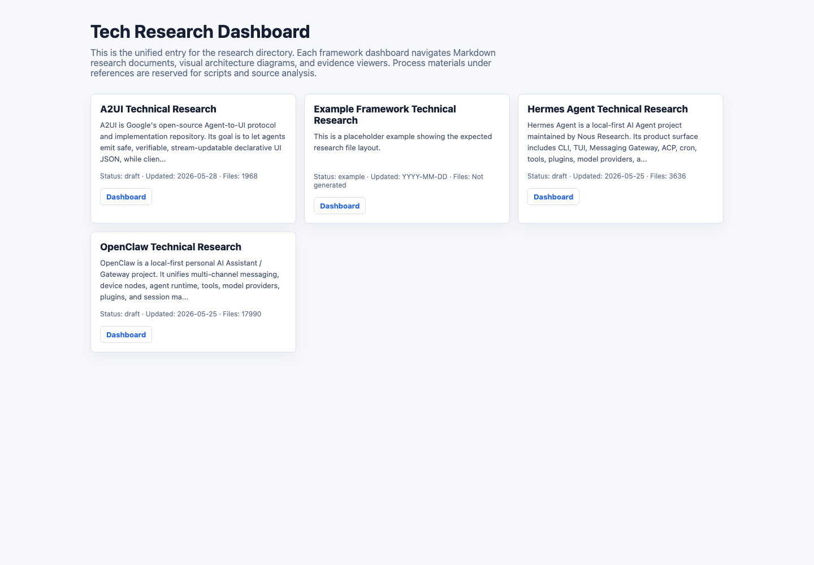
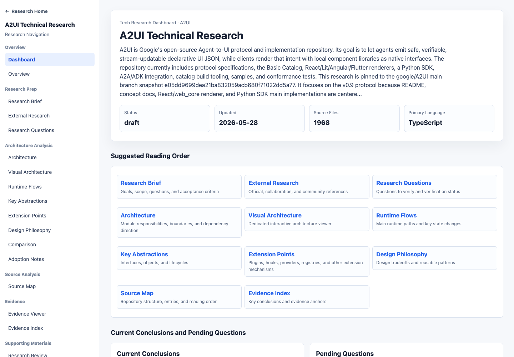

# Octopus Research Kit

An evidence-backed research kit for technologies, codebases, and AI systems. It turns source reading, framework analysis, architecture research, and technology evaluation into reviewable, reusable, and shareable research assets with structured templates, evidence indexes, validation scripts, and visual dashboards.

[](LICENSE)
[](package.json)
[](research/)





## Who This Is For

- Developers who want to understand unfamiliar technologies, open-source frameworks, or codebases systematically, not just collect links.
- Engineers who need to explain technical architecture, core abstractions, extension points, and design tradeoffs to a team.
- Teams using AI agents for technical research while still requiring traceable evidence for important conclusions.
- Anyone who wants to turn one research effort into reusable templates, workflow, and quality gates.

## What It Solves

Technical research often ends up scattered across chat logs, temporary notes, and screenshots. This repository gives that work a durable shape:

1. Define the target, scope, and deliverables in `research-brief.md`.
2. Convert external materials into source-verification questions with `external-research.md` and `research-questions.md`.
3. Use `source-map.md`, `architecture.md`, `runtime-flows.md`, and related documents to map structure and behavior.
4. Tie important conclusions to official docs, source files, tests, configuration, issues, PRs, release notes, or clearly labeled inferences in `evidence-index.md`.
5. Use dashboards, HTML document readers, and visual architecture diagrams to make the research easier to browse.
6. Run validation scripts before publishing to check structure, evidence coverage, privacy leaks, and release safety.

## What You Get

| Artifact | Purpose |
|---|---|
| Research Spec | Defines the goal, scope, questions, and completion standard for one research effort |
| Research Skill | Captures the agent workflow, evidence rules, and output contract |
| Markdown Document Set | Stores architecture, abstractions, flows, extension points, design philosophy, and adoption notes |
| Evidence Index | Maps key conclusions to sources, versions, code locations, or external references |
| Dashboard | Provides a single browsing entry for projects under `research/` |
| Visual Architecture | Shows architecture relationships that are hard to express clearly in Markdown |
| Release Checks | Checks structure, evidence, privacy, and whitespace before public release |

## Example Research

This repository includes sample research projects. Start from [research/index.html](research/index.html) for the unified dashboard:

| Target | Focus |
|---|---|
| [OpenClaw](research/openclaw/README.md) | Local-first personal AI Assistant / Gateway architecture |
| [Hermes Agent](research/hermes-agent/README.md) | Multi-entry agent runtime, tools, plugins, providers, and gateway flows |
| [A2UI](research/A2UI/README.md) | Agent-to-UI protocol, renderers, catalogs, and Python SDK |
| [example-framework](research/example-framework/README.md) | Starter structure for a new research directory |

## Quickstart

```bash
npm install
npm test
```

Create a new research directory:

```bash
mkdir -p research/<framework-name>
cp docs/tech-research-guide/templates/* research/<framework-name>/
```

Then start with `research/<framework-name>/research-brief.md`: define the target, version, scope, key questions, and deliverables before reading broadly.

More entry points:

- [QUICKSTART.md](QUICKSTART.md)
- [Tech Research Guide](docs/tech-research-guide/TECH_RESEARCH_GUIDE.md)
- [AI Tech Research Quickstart](docs/tech-research-guide/AI_TECH_RESEARCH_QUICKSTART.md)
- [Templates](docs/tech-research-guide/templates/)
- [Open-source tech research skill](skills/open-source-tech-research/SKILL.md)

## Recommended Flow

1. Make the target, version, code source, and out-of-scope items explicit.
2. Collect official docs, release notes, issues, PRs, and high-quality community material.
3. Turn external claims into source-verification questions.
4. Build the source map before analyzing core abstractions, runtime flows, extension points, and design philosophy.
5. Record every important conclusion in `evidence-index.md` with source type and location.
6. Generate the dashboard, evidence viewer, and visual architecture diagram.
7. Capture reusable patterns, adoption prerequisites, and misread risks in `adoption-notes.md`.
8. Run release checks before publishing.

## Repository Layout

```text
.
├── .github/
│   ├── ISSUE_TEMPLATE/
│   ├── PULL_REQUEST_TEMPLATE.md
│   └── workflows/
├── docs/
│   └── tech-research-guide/
│       ├── roles/
│       ├── scripts/
│       └── templates/
├── research/
│   ├── index.html
│   └── <framework-name>/
├── skills/
│   └── open-source-tech-research/
├── CONTRIBUTING.md
├── LICENSE
├── QUICKSTART.md
└── README.md
```

## Release Checks

Before publishing publicly, run at least:

```bash
npm run research:sanitize
npm run research:dashboard
npm run research:validate:strict
npm run release:check
git diff --check
```

These checks verify research structure, regenerated dashboards, common Mermaid issues, and likely privacy leaks such as local paths, tokens, or private-key shapes.

## Contributing

Contributions are welcome: templates, quality gates, sample research projects, script improvements, and documentation fixes all help. Please read [CONTRIBUTING.md](CONTRIBUTING.md), and keep important conclusions traceable to evidence.

If you want to request research for an open-source project, open an issue with the target, version, key questions, and expected outputs.

## Support This Project

If this research workspace helps you understand unfamiliar codebases faster, please consider giving the GitHub repository a Star.

Stars are not just encouragement. They help more people who need source research, architecture analysis, and evidence-backed technical writing discover the project.

## License

This repository is released under the [MIT License](LICENSE). You may use it for personal learning, internal team methods, and commercial project research workflows.

Third-party open-source projects, official docs, source snippets, and external materials referenced during research remain governed by their own licenses and terms. This repository does not relicense third-party content.
