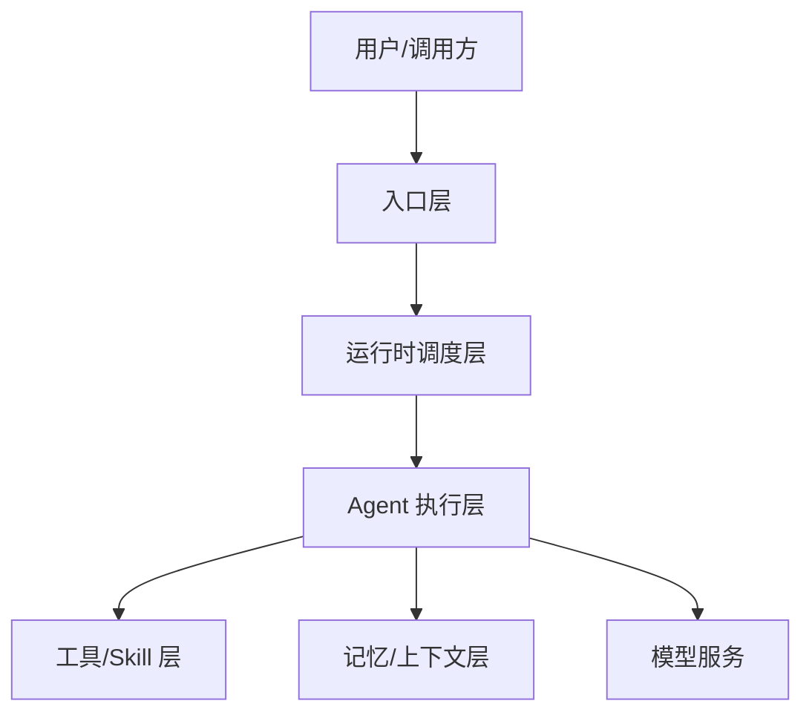

可以，这个方向非常适合单独做一套 **“技术调研 Spec / Technical Research Spec”**，不要和前面那套“开发实现 Spec”混在一起。

前面那套 Spec Coding 规范主要解决的是：**需求 → 设计 → 任务 → 代码 → 测试** 的协作和实现闭环。你现在这个新方向更偏：**源码阅读 → 架构抽象 → 设计思想提炼 → 横向对比 → 反哺自有系统重构**。它们理念一致，都是用 Spec 沉淀长期记忆、多人协同和跨模型上下文一致性，但产出目标不同。

---

# 一、这套规范建议命名

我建议命名为：

```text
Technical Research Spec
技术调研 Spec
开源框架源码分析 Spec
```

它的核心目标不是让 AI 直接写代码，而是让 AI 按一套稳定方法去理解一个开源框架：

```text
它解决什么问题？
它的架构分层是什么？
核心抽象是什么？
运行时链路怎么走？
设计思想是什么？
扩展机制是什么？
优缺点是什么？
哪些思想能迁移到我们的系统？
如果要借鉴重构，应该怎么落地？
```

---

# 二、它和开发 Spec 的区别

| 类型   | 开发实现 Spec                                  | 技术调研 Spec                                                                       |
| ---- | ------------------------------------------ | ------------------------------------------------------------------------------- |
| 目标   | 指导功能开发                                     | 指导源码分析和技术学习                                                                     |
| 输入   | 产品需求、会议纪要、业务想法                             | 开源仓库、源码、官方文档、技术博客、运行示例                                                          |
| 核心问题 | 要做什么、怎么做、怎么验收                              | 它为什么这么设计、怎么实现、能借鉴什么                                                             |
| 输出   | requirements / design / tasks / acceptance | research-goals / source-map / architecture / design-philosophy / adoption-notes |
| 约束重点 | 不扩大需求范围                                    | 不做无依据推断，所有结论要能追溯到源码或文档                                                          |
| 最终价值 | 可交付代码                                      | 可复用技术认知、架构思想、重构启发                                                               |

所以你现在要做的是第二套规范：**面向技术学习和架构借鉴的调研型 Spec**。

---

# 三、建议目录结构

可以放在你原来的规范体系旁边：

```text
docs/
  spec-coding-guide/
    SPEC_CODING_GUIDE.md
    AI_CODING_QUICKSTART.md

  tech-research-guide/
    TECH_RESEARCH_SPEC_GUIDE.md
    AI_TECH_RESEARCH_QUICKSTART.md
    GLOSSARY.md

    roles/
      research-lead.md
      source-code-analyst.md
      architecture-analyst.md
      design-philosophy-analyst.md
      adoption-architect.md
      reviewer.md

    templates/
      README-template.md
      research-charter-template.md
      source-map-template.md
      architecture-template.md
      runtime-flow-template.md
      design-philosophy-template.md
      extension-points-template.md
      evidence-log-template.md
      comparison-template.md
      adoption-notes-template.md
      refactor-opportunity-template.md
      research-review-template.md

  tech-research/
    <framework-name>/
      README.md
      research-charter.md
      source-map.md
      architecture.md
      runtime-flow.md
      key-abstractions.md
      design-philosophy.md
      extension-points.md
      evidence-log.md
      comparison.md
      adoption-notes.md
      refactor-opportunities.md
      research-review.md
      references/
```

---

# 四、一套完整技术调研 Spec 应该包含哪些文档

## 1. `research-charter.md`：调研章程

这是最重要的入口文档。它定义“这次调研到底要搞明白什么”。

建议包含：

```text
1. 调研对象
2. 调研版本 / 分支 / Commit
3. 调研背景
4. 调研目标
5. 核心研究问题
6. 本次重点关注范围
7. 本次不关注范围
8. 预期输出文档
9. 适用场景
10. 后续如何反哺自有系统
```

示例：

```markdown
# Research Charter: Open Source Agent Framework X

## 调研目标

本次调研目标是理解 Framework X 的多 Agent 编排、工具调用、上下文管理和插件扩展机制，并提炼可借鉴的架构思想，用于后续重构公司内部 Agent Runtime / Skill Runtime / Role Engine 相关系统。

## 核心研究问题

- Framework X 的整体架构分为哪些层？
- Agent、Session、Tool、Skill、Plugin 之间是什么关系？
- 一次用户请求从入口到最终响应的链路是什么？
- 它如何处理多 Agent 调度？
- 它如何隔离上下文？
- 它如何加载扩展能力？
- 它有哪些设计取舍？
- 哪些设计思想适合迁移到我们的系统？
- 哪些地方不适合直接照搬？
```

---

## 2. `source-map.md`：源码地图

这是帮助技术同学快速进入源码的文档。

建议包含：

```text
1. 仓库总体结构
2. 关键目录说明
3. 启动入口
4. 核心模块
5. 配置加载位置
6. 插件 / 扩展点位置
7. 核心接口和抽象类
8. 测试用例入口
9. 推荐阅读顺序
```

示例结构：

```markdown
# Source Map

## 1. 仓库结构

| 路径 | 作用 | 阅读优先级 |
|---|---|---|
| `cmd/` | CLI 或服务启动入口 | 高 |
| `runtime/` | 核心运行时 | 高 |
| `agent/` | Agent 抽象与执行逻辑 | 高 |
| `tools/` | Tool 调用与注册机制 | 中 |
| `plugins/` | 插件扩展机制 | 中 |
| `examples/` | 示例工程 | 高 |
| `docs/` | 官方说明文档 | 高 |

## 2. 推荐阅读顺序

1. 先看 README 和 examples
2. 找启动入口
3. 跟踪一次请求链路
4. 阅读核心抽象
5. 阅读插件和扩展点
6. 阅读测试用例验证理解
```

这个文档很有价值，因为很多人调研源码卡住，不是因为看不懂代码，而是不知道从哪里开始看。

---

## 3. `architecture.md`：技术架构文档

这是核心产物之一。

建议包含：

```text
1. 架构总览
2. 分层架构
3. 核心模块职责
4. 模块之间的依赖关系
5. 请求处理链路
6. 运行时状态管理
7. 扩展机制
8. 外部系统集成方式
9. 架构优点
10. 架构限制
```

可以要求 AI 输出 Mermaid 图：



技术调研 Spec 里要明确要求：

> 架构图必须基于源码证据，不得只根据 README 或想象生成。

---

## 4. `runtime-flow.md`：运行时链路分析

这个文档用于回答：

```text
一次请求到底怎么跑起来？
```

建议包含：

```text
1. 用户请求入口
2. 参数解析
3. 配置加载
4. Agent / Runtime 初始化
5. 上下文构造
6. 工具选择
7. 模型调用
8. 结果处理
9. 错误处理
10. 响应返回
```

示例：

```markdown
# Runtime Flow

## 主链路：用户请求到最终响应

1. 用户请求进入 Gateway / CLI / API
2. 系统解析请求参数
3. 加载项目配置
4. 初始化 Runtime Context
5. 根据配置选择 Agent
6. Agent 构造 Prompt / Context
7. Agent 决定是否调用 Tool
8. Tool 执行并返回结构化结果
9. Agent 汇总结果
10. Runtime 输出最终响应

## 关键问题

- Tool 调用是模型驱动还是规则驱动？
- 上下文是在 Runtime 层维护，还是 Agent 层维护？
- Agent 是否有生命周期？
- Tool 执行失败后如何处理？
- 是否支持流式输出？
```

---

## 5. `key-abstractions.md`：核心抽象分析

这个文档对架构学习非常重要。

建议分析：

```text
1. Agent 抽象
2. Session 抽象
3. Runtime 抽象
4. Tool / Skill 抽象
5. Plugin 抽象
6. Memory / Context 抽象
7. Event / Message 抽象
8. Config 抽象
```

每个抽象都要用统一结构：

```markdown
## Agent

### 它解决什么问题

### 关键源码位置

### 核心字段 / 方法

### 生命周期

### 和其他对象的关系

### 设计优点

### 设计限制

### 可借鉴点
```

这个文档能帮你把“看源码”转成“看设计模型”。

---

## 6. `design-philosophy.md`：设计思想提炼

这是你特别需要的文档。

它不是简单描述代码，而是提炼思想。

建议结构：

```text
1. 框架的核心设计理念
2. 它优先解决的问题
3. 它主动牺牲了什么
4. 它的边界意识
5. 它的扩展思想
6. 它的运行时思想
7. 它的数据 / 状态思想
8. 它的工程化思想
9. 对我们系统的启发
```

示例：

```markdown
# Design Philosophy

## 1. 设计思想一：运行时与能力定义分离

### 现象

源码中 Runtime 负责执行调度，Tool / Skill 作为外部能力注册进入运行时。

### 解决的问题

避免把业务能力写死在 Runtime 中，使框架可以通过配置或插件扩展能力。

### 设计取舍

优点：
- Runtime 更稳定
- 能力扩展更灵活
- 易于插件化

代价：
- 调试链路更长
- 配置复杂度上升
- 能力边界需要额外治理

### 对我们的启发

可以用于重构内部角色智伴运行时：
- 角色引擎负责生成 Role Runtime Spec
- OpenClaw Runtime 负责执行
- Skill 通过能力市场或角色配置动态注入
```

这个文档会非常适合你后续做系统重构时复用。

---

## 7. `extension-points.md`：扩展机制分析

开源框架最值得学的地方之一是扩展机制。

建议分析：

```text
1. 插件如何注册
2. 插件如何发现
3. 插件如何加载
4. 插件如何执行
5. 插件如何隔离
6. 插件如何配置
7. 插件如何返回结果
8. 插件失败如何处理
9. 是否支持用户自定义扩展
10. 扩展点设计是否稳定
```

可以做成表格：

| 扩展点           | 作用     | 源码位置  | 使用方式        | 可借鉴点           |
| ------------- | ------ | ----- | ----------- | -------------- |
| Tool Registry | 管理工具注册 | `xxx` | 配置 / 代码注册   | 可用于能力市场接入      |
| Plugin Loader | 加载插件   | `xxx` | 扫描目录 / 配置加载 | 可用于动态 Skill 加载 |

---

## 8. `evidence-log.md`：证据日志

这个文档非常关键。
技术调研最怕 AI 胡说，所以必须要求每个重要结论能追溯到源码或官方文档。

建议格式：

```markdown
# Evidence Log

| 编号 | 结论 | 证据类型 | 位置 | 说明 |
|---|---|---|---|---|
| EVD-001 | Runtime 负责 Agent 调度 | 源码 | `runtime/manager.go` | 核心调度逻辑在 manager 中 |
| EVD-002 | Tool 通过配置注册 | 源码 | `config/tools.ts` | 配置文件解析 tool 定义 |
| EVD-003 | 支持流式输出 | 文档 | `docs/streaming.md` | 官方文档说明 streaming 配置 |
```

规则：

```text
没有证据的结论，必须标记为“推测”或“待验证”。
```

这是技术调研 Spec 和普通 AI 总结最大的区别。

---

## 9. `comparison.md`：横向对比文档

用于对比多个框架，比如：

```text
OpenClaw vs Hermes
LangGraph vs AutoGen
Dify vs Coze
CrewAI vs Agno
```

建议维度：

```text
1. 定位
2. 架构风格
3. Agent 抽象
4. Tool 抽象
5. Workflow / DAG 能力
6. Memory 能力
7. 插件机制
8. 多 Agent 协作
9. 工程化程度
10. 二次开发友好度
11. 企业集成难度
12. 可借鉴点
```

示例表格：

| 维度         | Framework A | Framework B | 对我们系统的启发           |
| ---------- | ----------- | ----------- | ------------------ |
| Runtime 模型 | 中心化调度       | 图式编排        | 可考虑运行时和流程编排分离      |
| Tool 机制    | 配置注册        | 函数式注册       | 内部 Skill 可采用注册中心治理 |
| Memory     | 会话级         | 图状态级        | 适合不同业务场景           |

---

## 10. `adoption-notes.md`：借鉴与落地建议

这是从“学会它”到“改造自己系统”的桥梁。

建议结构：

```text
1. 可以直接借鉴的设计
2. 需要改造后借鉴的设计
3. 不建议借鉴的设计
4. 和我们现有系统的映射关系
5. 落地优先级
6. 风险
7. 建议验证方式
```

示例：

| 开源框架设计          | 解决的问题     | 我们系统中的对应问题     | 是否可借鉴 | 落地建议                   |
| --------------- | --------- | -------------- | ----- | ---------------------- |
| Tool Registry   | 工具统一注册和调用 | Skill 安装和运行时发现 | 可借鉴   | 结合能力市场做 Skill Registry |
| Plugin Loader   | 插件动态加载    | 角色技能动态装配       | 部分借鉴  | 需要增加租户和权限控制            |
| Runtime Context | 上下文隔离     | 多角色会话隔离        | 可借鉴   | 和角色引擎输出的 Role Spec 结合  |

---

## 11. `refactor-opportunities.md`：重构机会文档

这个文档很适合你后续重构其他系统。

建议结构：

```text
1. 当前系统痛点
2. 从开源框架学到的模式
3. 可重构模块
4. 重构前后对比
5. 最小验证方案
6. 分阶段演进路径
```

示例：

```markdown
# Refactor Opportunities

## 1. 当前痛点

当前角色智伴 Skill 主要依赖人工安装，运行态无法根据角色自动装配能力。

## 2. 参考框架中的启发

Framework X 将 Tool 注册、发现、执行和 Runtime 解耦，使运行时可以根据上下文动态选择能力。

## 3. 重构机会

建设内部 Role Skill Registry：

- 角色引擎输出角色运行时配置
- 能力市场提供 Skill 元数据
- OpenClaw Runtime 根据配置加载可用 Skill
- Bridge Service 负责用户身份和实例路由

## 4. 最小验证

选择客户代表角色，验证自动加载 2-3 个角色 Skill。
```

---

# 五、技术调研 Spec 的角色设计

建议定义 6 个轻量角色。

## 1. Research Lead：调研负责人

职责：

```text
定义调研目标、范围、研究问题和输出物。
```

边界：

```text
不直接下源码结论，不做无证据判断。
```

---

## 2. Source Code Analyst：源码分析员

职责：

```text
阅读源码，梳理目录、入口、关键类、核心调用链。
```

边界：

```text
所有结论必须关联源码路径。
```

---

## 3. Architecture Analyst：架构分析员

职责：

```text
提炼架构分层、模块职责、运行时链路和扩展机制。
```

边界：

```text
不得脱离源码证据画架构图。
```

---

## 4. Design Philosophy Analyst：设计思想分析员

职责：

```text
从源码结构和架构设计中提炼设计原则、取舍和背后的思想。
```

边界：

```text
不得把个人偏好写成框架设计思想。
```

---

## 5. Adoption Architect：落地转化架构师

职责：

```text
把开源框架中的设计思想映射到公司内部系统，形成借鉴、重构和演进建议。
```

边界：

```text
不得直接照搬开源框架设计，必须结合内部系统约束。
```

---

## 6. Research Reviewer：调研审查者

职责：

```text
检查结论是否有证据、架构图是否可信、设计思想是否过度解读、落地建议是否可执行。
```

边界：

```text
只做审查和建议，不直接扩大调研结论。
```

---

# 六、建议的调研流程

```text
1. 明确调研目标
   ↓
2. 建立 research-charter.md
   ↓
3. 收集资料：README、官方文档、源码、示例、Issue、测试用例
   ↓
4. 生成 source-map.md
   ↓
5. 跟踪主运行链路，生成 runtime-flow.md
   ↓
6. 提炼核心抽象，生成 key-abstractions.md
   ↓
7. 总结架构分层，生成 architecture.md
   ↓
8. 分析扩展机制，生成 extension-points.md
   ↓
9. 提炼设计思想，生成 design-philosophy.md
   ↓
10. 记录证据，维护 evidence-log.md
   ↓
11. 形成借鉴建议，生成 adoption-notes.md
   ↓
12. 输出重构机会，生成 refactor-opportunities.md
   ↓
13. 做 research-review.md 审查
```

---

# 七、它最重要的规则：结论必须有证据

技术调研 Spec 必须比开发 Spec 更强调“证据”。

建议写进规范：

```text
所有架构结论、设计思想、运行链路、扩展机制判断，都必须至少满足以下一种证据来源：

1. 源码路径
2. 官方文档
3. 示例工程
4. 测试用例
5. 配置文件
6. Commit / Issue / Release Note

如果没有证据，只能写为：
- 推测
- 待验证
- 可能的设计意图
```

错误示例：

```text
该框架采用高度插件化架构。
```

正确示例：

```text
该框架具备插件化扩展特征，证据包括：
- `plugins/` 目录存在独立插件加载逻辑
- 配置文件中支持声明 plugin
- 示例工程中展示了自定义 plugin 的注册方式

但是否支持运行时热加载仍待验证。
```

---

# 八、建议增加一个“调研质量门禁”

在输出最终架构文档前，做一次检查：

```text
Research Quality Gate

[ ] 是否明确调研版本 / 分支 / Commit？
[ ] 是否明确本次调研范围？
[ ] 是否明确不调研范围？
[ ] 是否生成 source-map？
[ ] 是否跟踪至少一条主运行链路？
[ ] 是否识别核心抽象？
[ ] 是否识别扩展点？
[ ] 架构图是否有源码证据支撑？
[ ] 设计思想是否来自源码结构，而不是主观想象？
[ ] 关键结论是否记录到 evidence-log？
[ ] 是否区分“事实”“推测”“待验证”？
[ ] 是否输出对自有系统的借鉴建议？
[ ] 是否说明哪些设计不适合直接照搬？
```

---

# 九、一个贯穿示例

假设你输入：

```text
帮我调研某开源 Agent 框架，重点看它的 Agent Runtime、Tool 调用、插件机制、多 Agent 编排和上下文管理，后续我想借鉴到公司内部角色智伴和 Skill Runtime 重构中。
```

AI 应该先生成：

```text
docs/tech-research/framework-x/
  README.md
  research-charter.md
  source-map.md
  architecture.md
  runtime-flow.md
  key-abstractions.md
  extension-points.md
  design-philosophy.md
  evidence-log.md
  adoption-notes.md
  refactor-opportunities.md
```

其中 `research-charter.md` 先写：

```markdown
## 本次重点

- Agent Runtime
- Tool / Skill 调用机制
- Plugin 扩展机制
- 多 Agent 编排方式
- Context / Memory 管理
- 对内部角色智伴系统的可借鉴点

## 本次不重点关注

- UI 实现
- 云部署商业化能力
- 计费系统
- 非核心示例代码
```

`adoption-notes.md` 里要有这种映射：

| 框架设计                | 内部系统映射                     | 借鉴方式          |
| ------------------- | -------------------------- | ------------- |
| Runtime 与 Tool 解耦   | OpenClaw Runtime 与角色 Skill | 借鉴动态注册和执行隔离   |
| Plugin Registry     | 能力市场 / Skill 市场            | 可作为能力发现入口     |
| Context Manager     | 角色智伴上下文                    | 借鉴会话隔离和上下文裁剪  |
| Multi-Agent Planner | 客创链路 SOP / DAG             | 借鉴任务规划和执行状态管理 |

---

# 十、我建议你下一步生成的规范包

建议生成一套独立包：

```text
tech-research-spec-guide.zip
```

里面包含：

```text
TECH_RESEARCH_SPEC_GUIDE.md
AI_TECH_RESEARCH_QUICKSTART.md
GLOSSARY.md

roles/
  research-lead.md
  source-code-analyst.md
  architecture-analyst.md
  design-philosophy-analyst.md
  adoption-architect.md
  reviewer.md

templates/
  README-template.md
  research-charter-template.md
  source-map-template.md
  architecture-template.md
  runtime-flow-template.md
  key-abstractions-template.md
  design-philosophy-template.md
  extension-points-template.md
  evidence-log-template.md
  comparison-template.md
  adoption-notes-template.md
  refactor-opportunities-template.md
  research-review-template.md

examples/
  agent-framework-research-example/
    README.md
    research-charter.md
    source-map.md
    architecture.md
    runtime-flow.md
    design-philosophy.md
    adoption-notes.md
```

---

# 十一、我的建议结论

你这个想法非常值得做，而且它和你之前的 Spec Coding 规范可以组成两套互补体系：

```text
开发实现 Spec：
用于把需求稳定地交给 AI 实现。

技术调研 Spec：
用于把开源框架稳定地转化成技术认知、架构思想和重构启发。
```

对你现在的工作特别有价值，因为你经常需要研究：

```text
OpenClaw
Hermes Agent
Codex
多 Agent 框架
Skill Runtime
MCP / ACP / Bridge
角色引擎
插件机制
Agent Runtime
```

如果每次调研都只靠聊天记录，后续很难复用。
如果沉淀成 Technical Research Spec，以后你就能形成自己的**技术认知库**：

```text
读源码 → 画架构 → 提炼思想 → 对比框架 → 映射内部系统 → 指导重构
```

这套规范的价值不只是“学习开源项目”，而是把开源项目的设计思想转化成你自己的架构资产。
