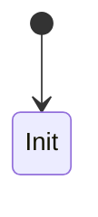

# Data Design

## 1. 核心对象

| 对象编号 | 对象名称 | 说明 | 关联需求 |
|---|---|---|---|
| DATA-OBJ-001 |  |  | REQ-001 |

## 2. 字段设计

| 对象 | 字段 | 类型 | 是否必填 | 说明 |
|---|---|---|---|---|
|  |  |  |  |  |

## 3. 状态枚举

| 状态 | 含义 | 进入条件 | 退出条件 |
|---|---|---|---|
|  |  |  |  |

## 4. 状态流转

## 5. 数据来源

## 6. 数据写入方

## 7. 数据读取方

## 8. 数据一致性要求

## 9. 数据风险
