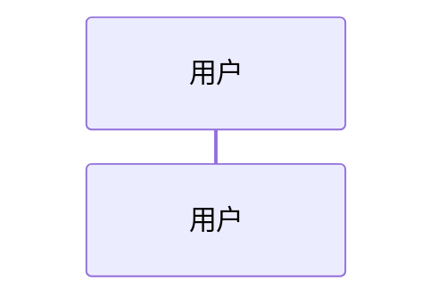
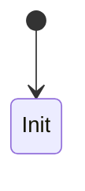

# Technical Design

## 1. 设计目标

## 2. 需求映射

| 设计项 | 关联需求 | 说明 |
|---|---|---|
| DES-001 | REQ-001 |  |

## 3. 系统参与者

| 参与者 | 类型 | 职责 | 边界 |
|---|---|---|---|
|  |  |  |  |

## 4. 模块边界

## 5. 主流程设计

## 6. 异常流程设计

| 编号 | 异常场景 | 处理策略 | 是否重试 | 是否需要人工介入 |
|---|---|---|---|---|
| DES-EX-001 |  |  |  |  |

## 7. 状态流转

## 8. 架构必要约束

| 编号 | 约束 | 原因 | 实现策略 |
|---|---|---|---|
| NFR-001 | 幂等 |  |  |

## 9. 权限与安全

## 10. 日志与监控

## 11. 风险与应对

| 风险编号 | 风险 | 影响 | 应对 |
|---|---|---|---|
| RISK-001 |  |  |  |

## 12. 后续扩展点

## 13. 不纳入本期设计项
