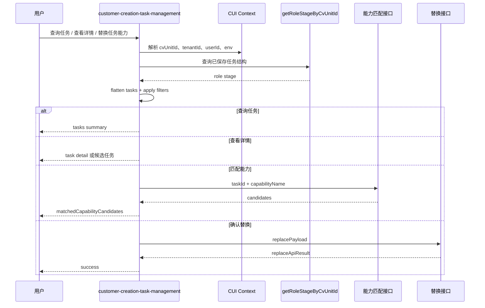

# Design

## 1. 总体设计

新 Skill 以 `docs/specs/runtime-capability-replacement` 为复制基底，再吸收现有 `task-capability-replacement` 的可运行脚本能力。整体上不是推翻替换设计，而是把“替换前必须查询和定位任务”的步骤升级为可独立触发的任务管理能力。

复制基底后，将原 spec 中的替换链路拆成四个可组合阶段：

1. `context`: 解析运行态上下文、环境和接口配置。
2. `task_query`: 查询并拍平客创单元任务结构。
3. `task_resolution`: 基于槽位、过滤条件或上一轮候选定位任务。
4. `capability_binding`: 匹配能力、构造替换 payload、确认后写入。



## 2. 从 runtime-capability-replacement 复制后的修改点

| 原基底内容 | 新 Skill 修改 |
| --- | --- |
| 目标是“替换任务关联能力” | 目标扩展为“查询任务、查看任务详情、匹配能力、替换能力” |
| 槽位模型只有 `task` 与 `capability` | 增加 `action`、任务过滤槽位、`taskSelection`、`matchSelection` |
| 查询任务只是替换前置步骤 | 查询任务成为 `query_tasks` 独立 action |
| `needs_confirmation` 主要用于缺任务或能力候选 | 确认态同时支持任务候选续接和能力候选续接 |
| 输出聚焦替换结果 | 输出增加任务摘要、任务详情、过滤结果 |
| spec 文件名和入口偏替换 | 改为 `customer-creation-task-management` 和 `manage_customer_creation_tasks.py` |

需要保留的基底约束：

- 不依赖第一次生成的本地 artifact。
- 优先查询服务端已保存能力结构。
- 替换动作保持任务 SOP ID 不变。
- 替换动作不重置任务状态、执行记录和分派信息。
- 旧能力绑定不能无限追加。
- 服务端替换接口不可用时不得宣称保存成功。

## 3. 与现有 Skill 的关系

建议保留 `task-capability-replacement` 一段过渡期，但逐步降级为兼容入口：

| 能力 | 现有 `task-capability-replacement` | 新 `customer-creation-task-management` |
| --- | --- | --- |
| 运行态上下文解析 | 已具备 | 复用 |
| endpoint/env 配置 | 已具备 | 复用 |
| 查询 role stage | 已具备 | 复用并提升为一等 action |
| flatten tasks | 已具备 | 扩展过滤字段和摘要模型 |
| 任务定位 | 已具备 | 支持上一轮序号、过滤条件、能力反查 |
| 能力匹配 | 已具备 | 作为独立 `match_task_capability` |
| 替换确认 | 已具备 | 保留 pendingResult 续接 |
| 替换写入 | 已具备 | 复用 |

迁移时优先将现有脚本中的函数拆到新脚本，而不是复制一份继续发散。

## 4. 建议目录

```text
skills/customer-creation-task-management/
  SKILL.md
  env/config.yaml
  scripts/
    manage_customer_creation_tasks.py
    common/runtime_context/context_extractor.py
  examples/
    role_stage_response_sample.json
```

`SKILL.md` frontmatter 建议：

```yaml
---
name: customer-creation-task-management
version: 0.1.0
execution_mode: main_session
subagent_allowed: false
entrypoint: scripts/manage_customer_creation_tasks.py
description: 查询客创单元任务、查看任务详情和替换任务下关联能力的任务类 Skill。当用户说“查询当前任务”“查看某任务绑定能力”“把某任务下能力换成某能力”等任务管理类请求时触发。本 Skill 不首次生成客创能力结构，不执行任务关联业务能力。
---
```

仍建议 `main_session`，原因是当前 CUI 上下文、sessionKey 和 pendingResult 续接都依赖主会话稳定传递。

## 5. CLI 输入设计

```bash
python3 scripts/manage_customer_creation_tasks.py \
  --action query_tasks \
  --text "查一下当前有哪些任务" \
  --session-key "<session_status 返回的当前主会话 sessionKey>" \
  --run-id "<主会话生成 runId>"
```

替换首轮：

```bash
python3 scripts/manage_customer_creation_tasks.py \
  --action replace_task_capability \
  --text "把规划供给的能力任务下的能力换成合同合规性审核" \
  --session-key "<sessionKey>" \
  --run-id "<runId>" \
  --confirm
```

替换确认轮：

```bash
python3 scripts/manage_customer_creation_tasks.py \
  --action replace_task_capability \
  --pending-result-json '<上一轮 RESULT_JSON>' \
  --match-selection "1" \
  --confirm-match \
  --session-key "<sessionKey>" \
  --run-id "<runId>"
```

主要参数：

| 参数 | 说明 |
| --- | --- |
| `--action` | `auto/query_tasks/get_task_detail/match_task_capability/replace_task_capability` |
| `--text` | 用户自然语言 |
| `--task-id/--task-sop-id/--task-name` | 任务定位 |
| `--stage-name/--supply-capacity-name/--business-sop-name` | 查询过滤 |
| `--current-capability-name` | 按当前绑定能力反查任务 |
| `--capability-name/--capability-desc` | 新能力匹配槽位 |
| `--pending-result-json` | 续接上一轮确认态 |
| `--match-selection` | 候选能力选择 |
| `--task-selection` | 候选任务选择，支持序号或 taskSopId |
| `--confirm` | 允许进入匹配阶段，但不代表最终写入 |
| `--confirm-match` | 用户已确认候选能力，允许调用替换接口 |
| `--dry-run` | 只生成请求，不写入 |

## 6. Action 识别

`--action=auto` 时按以下规则识别：

| 关键词 | Action |
| --- | --- |
| 查询、列出、有哪些任务、任务列表 | `query_tasks` |
| 查看、详情、当前能力、绑定了什么能力 | `get_task_detail` |
| 匹配能力、推荐能力、能换成哪些 | `match_task_capability` |
| 替换、换成、改成、绑定到 | `replace_task_capability` |

如果同时命中“查询”和“替换”，以写入意图为准，但仍必须先查询任务结构并进入确认流。

## 7. 数据模型

内部任务模型：

```json
{
  "cvUnitId": "443802647720415232",
  "customerId": "1818712263238877184",
  "intentionId": "1818504460566003712",
  "stageId": "1001",
  "stageName": "供能力规划阶段",
  "supplyCapacityId": "3001",
  "supplyCapacityName": "供给规划",
  "businessSopId": "4001",
  "businessSopName": "规划供给的能力事项",
  "taskSopId": "5001",
  "taskId": "5001",
  "taskName": "规划供给的能力",
  "taskDescription": "规划供给的能力任务",
  "taskStatus": 0,
  "currentCapabilityIds": ["7001"],
  "currentCapabilities": ["单节点生成供能力"],
  "capabilities": [
    {
      "id": "7001",
      "recordId": "6001",
      "name": "单节点生成供能力",
      "description": "创建单节点生成供能力应用",
      "agentId": "agent-old",
      "spuCode": "SPU-OLD",
      "skuCode": "SKU-OLD",
      "source": "market"
    }
  ]
}
```

任务摘要模型：

```json
{
  "index": 1,
  "taskSopId": "5001",
  "taskName": "规划供给的能力",
  "stageName": "供能力规划阶段",
  "supplyCapacityName": "供给规划",
  "businessSopName": "规划供给的能力事项",
  "taskStatus": 0,
  "currentCapabilities": ["单节点生成供能力"]
}
```

## 8. 查询与过滤

现有查询接口继续作为第一阶段数据源：

```http
GET /ai-role-main/api/icome/getRoleStageByCvUnitId?cvUnitId={cvUnitId}
```

过滤规则：

- ID 条件使用精确匹配。
- 名称条件先精确匹配，再包含匹配。
- 多个过滤条件为 AND。
- `taskSelection` 可从上一轮 `candidateTaskSummary[index]` 反查任务。
- 所有过滤后的任务按 role stage 原始遍历顺序生成稳定 `index`。

## 9. 能力匹配与替换

能力匹配接口沿用现有逻辑：

```http
POST /icome-eo-server-poc/capacity/capability/element/matching
```

替换接口沿用现有服务端专用接口：

```http
POST /ai-role-main/api/supply/v2/replace/market/capability
```

关键约束：

- `replacePayload.businessSopId` 传任务 SOP ID，即 `task.taskSopId`。
- `marketSupplyCapacityList[].spuCode` 使用匹配结果中的 `spuCode/capacity_id`。
- `skuCode`、`agentId` 必须从候选能力透传到 `sku` 子对象。
- 不把 `P...` 形式的 spu 编码填到需要 Long 的 ID 字段。
- 替换接口失败时返回响应摘要，不宣称替换成功。

## 10. 确认态设计

写入动作分两轮：

1. 首轮定位任务并调用能力匹配，返回 `status=needs_confirmation`、候选能力、旧能力和 `replacePayload`。
2. 用户确认后，主会话将上一轮完整 `RESULT_JSON` 作为 `pendingResult/previousResult` 传回，并附带 `--confirm-match`。

任务多候选也分两轮：

1. 返回 `status=needs_confirmation`、`reason=ambiguous_task_name`、`candidateTaskSummary`。
2. 用户选择“第 N 个”后，通过 `--task-selection N` 续接原动作。

确认态必须包含：

- `action`
- `reason`
- `candidateTaskSummary` 或 `matchedCapabilityCandidates`
- `matchedCapabilityCandidateSummary`，字段固定包含 `index/capabilityType/capabilityName/capabilityDesc`
- `requestedCapability`
- `task` 或任务候选
- `replacePayload`，仅能力替换确认态需要
- `runIdentity`

## 11. 输出文件隔离

沿用现有 run scoped output 规则：

```text
output/runs/session-<sha256(parentSessionKey 或 sessionKey)[:12]>/run-<runId>/task_management_result.json
```

stdout 必须输出：

```text
run_id=<runId>
output_dir=<outputDir>
summary=<outputJsonPath>
output=<outputJsonPath>
```

主会话读取 stdout 中的 `summary=` 路径，不扫描固定 `output/` 目录。

## 12. 兼容策略

短期兼容：

- `task-capability-replacement` 可保留，但 `SKILL.md` 中说明新任务类请求应转向 `customer-creation-task-management`。
- 旧脚本 `replace_task_capability.py` 可作为薄包装，调用新脚本并强制 `--action replace_task_capability`。
- 旧输出字段 `oldCapabilities`、`matchedCapabilityCandidates`、`replacePayload` 保持兼容。

长期目标：

- 删除重复的替换逻辑，只维护新 Skill 的 `manage_customer_creation_tasks.py`。
- 将 runtime context extractor 继续作为 vendored copy，但保持与仓库公共版本同步。
