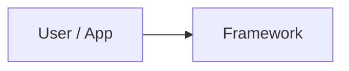
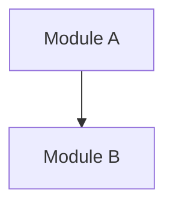

# Architecture

## 1. 架构摘要

## 2. 架构上下文

## 3. 模块边界

| 模块 | 职责 | 输入 | 输出 | 关键证据 |
|---|---|---|---|---|
|  |  |  |  |  |

## 4. 核心抽象

| 抽象 | 作用 | 典型实现 | 关键证据 |
|---|---|---|---|
|  |  |  |  |

## 5. 依赖方向

## 6. 数据和状态流

## 7. 扩展机制

| 扩展点 | 使用方式 | 框架如何发现/调用 | 关键证据 |
|---|---|---|---|
|  |  |  |  |

## 8. 架构取舍

| 取舍 | 收益 | 代价 | 证据 |
|---|---|---|---|
|  |  |  |  |

## 9. 待确认问题

- 
