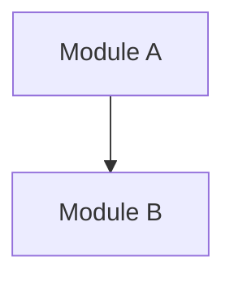

# Technical Architecture

## 1. Architecture Summary

## 2. Architecture Context

## 3. Module Boundaries

| Module | Responsibility | Input | Output | Key evidence |
|---|---|---|---|---|
|  |  |  |  |  |

## 4. Core Abstractions

| Abstraction | Role | Typical implementation | Key evidence |
|---|---|---|---|
|  |  |  |  |

## 5. Dependency Direction

## 6. Visual Architecture

- [Open the HTML visual architecture diagram](./visual/architecture.html)
- Graph data: [visual/architecture.visual.js](./visual/architecture.visual.js)
- Evidence viewer: [visual/evidence.html](./visual/evidence.html)
- Evidence data: [visual/evidence.visual.js](./visual/evidence.visual.js)

This section contains links only. Architecture conclusions remain in this document and `evidence-index.md`; HTML is only the visual presentation layer.

## 7. Data and State Flow

## 8. Extension Mechanisms

| Extension point | Usage | How the framework discovers/calls it | Key evidence |
|---|---|---|---|
|  |  |  |  |

## 9. Architecture Tradeoffs

| Tradeoff | Benefit | Cost | Evidence |
|---|---|---|---|
|  |  |  |  |

## 10. Pending Questions

-
