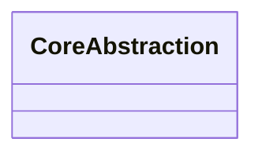

# 核心抽象

## 1. 抽象总览

| 抽象 | 类型 | 职责 | 生命周期 | 关键证据 |
|---|---|---|---|---|
|  | Interface/Class/Function/Data |  |  |  |

## 2. 抽象关系

## 3. 关键接口

| 接口/函数 | 调用方 | 实现方 | 输入 | 输出 | 证据 |
|---|---|---|---|---|---|
|  |  |  |  |  |  |

## 4. 关键数据结构

| 数据结构 | 字段/状态 | 创建位置 | 消费位置 | 证据 |
|---|---|---|---|---|
|  |  |  |  |  |

## 5. 生命周期对象

| 对象 | 创建 | 初始化 | 使用 | 释放 | 证据 |
|---|---|---|---|---|---|
|  |  |  |  |  |  |

## 6. 设计观察

- 

## 7. 待确认

- 
