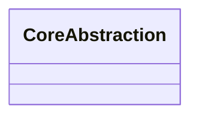

# Key Abstractions

## 1. Abstraction Overview

| Abstraction | Type | Responsibility | Lifecycle | Key evidence |
|---|---|---|---|---|
|  | Interface/Class/Function/Data |  |  |  |

## 2. Abstraction Relationships

## 3. Key Interfaces

| Interface/function | Caller | Implementer | Input | Output | Evidence |
|---|---|---|---|---|---|
|  |  |  |  |  |  |

## 4. Key Data Structures

| Data structure | Fields/state | Created at | Consumed at | Evidence |
|---|---|---|---|---|
|  |  |  |  |  |

## 5. Lifecycle Objects

| Object | Creation | Initialization | Usage | Release | Evidence |
|---|---|---|---|---|---|
|  |  |  |  |  |  |

## 6. Design Observations

-

## 7. Pending

-
