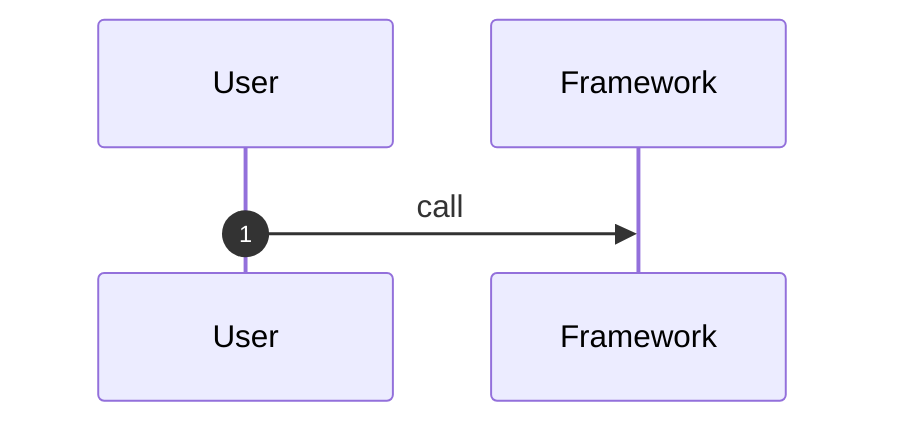

# 运行流程

## Flow 1: <场景名称>

### 1. 场景说明

### 2. 入口

| 类型 | 位置 | 说明 |
|---|---|---|
| API/CLI/Test/Example |  |  |

### 3. 时序图

### 4. 关键步骤

| 步骤 | 代码位置 | 做了什么 | 状态变化 | 证据 |
|---|---|---|---|---|
| 1 |  |  |  |  |

### 5. 异常和边界

| 场景 | 处理方式 | 证据 |
|---|---|---|
|  |  |  |

### 6. 设计观察

- 

### 7. 待确认

- 
