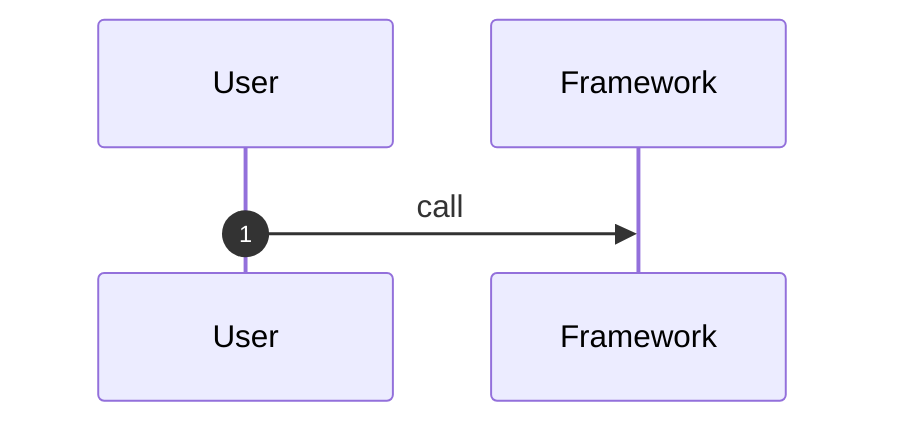

# Runtime Flows

## Flow 1: <Scenario Name>

### 1. Scenario

### 2. Entry Point

| Type | Location | Notes |
|---|---|---|
| API/CLI/Test/Example |  |  |

### 3. Sequence Diagram

### 4. Key Steps

| Step | Code location | What happens | State change | Evidence |
|---|---|---|---|---|
| 1 |  |  |  |  |

### 5. Exceptions and Boundaries

| Scenario | Handling | Evidence |
|---|---|---|
|  |  |  |

### 6. Design Observations

-

### 7. Pending

-
