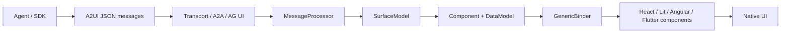
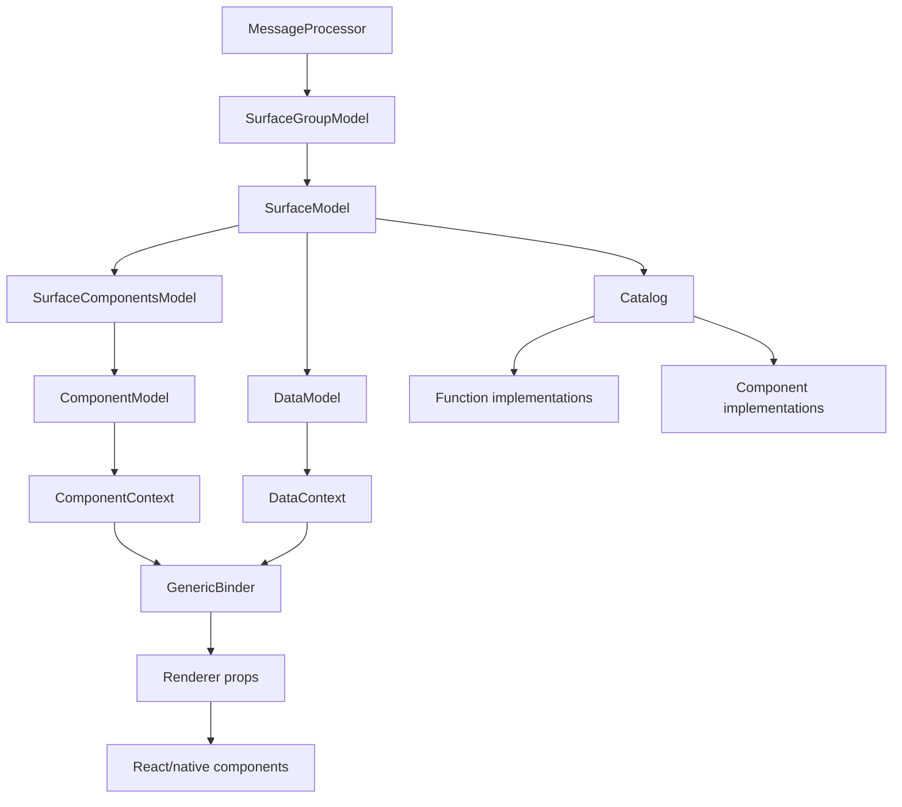

# Architecture

## One-Sentence Architecture

A2UI constrains agent-generated UI intent to a verifiable JSON message stream. The client interprets those messages with a catalog, maintains surface/component/data-model state, and maps them to a local component library through a renderer adapter.

## Layers

| Layer | Main Responsibility | Representative Files | Evidence |
|---|---|---|---|
| Protocol layer | Defines message types, common types, catalog, and transport constraints | `specification/v0_9/docs/a2ui_protocol.md`, `specification/v0_9/json/server_to_client.json` | EVD-007, EVD-008 |
| Catalog layer | Defines available components, functions, and theme schema as the capability boundary between renderer and agent | `specification/v0_9/catalogs/basic/catalog.json`, `renderers/web_core/src/v0_9/catalog/types.ts` | EVD-013, EVD-024 |
| State layer | Manages surfaces, components, data model, and action dispatch | `renderers/web_core/src/v0_9/state/*.ts` | EVD-017, EVD-018, EVD-019 |
| Binding layer | Converts dynamic/action/child/checkable schema fields into renderer props | `renderers/web_core/src/v0_9/rendering/generic-binder.ts` | EVD-021 |
| Renderer adapter layer | Maps A2UI component implementations to a concrete UI framework | `renderers/react/src/v0_9/A2uiSurface.tsx`, `renderers/react/src/v0_9/adapter.tsx` | EVD-014, EVD-015 |
| Agent SDK layer | Prompt injection, JSON repair, schema/catalog selection, validation, and A2A conversion | `agent_sdks/python/src/a2ui/**/*.py` | EVD-027, EVD-028, EVD-029 |
| Tooling/validation layer | Catalog assembly, conformance, and renderer tests | `tools/build_catalog/assemble_catalog.py`, `agent_sdks/conformance/README.md`, renderer tests | EVD-032, EVD-033 |

## Core Component Relationships

### MessageProcessor

`MessageProcessor` is the client-side center for receiving A2UI server-to-client messages. It owns `SurfaceGroupModel` and creates surfaces, updates components, updates data model, or deletes surfaces by message type. It also exposes `getClientCapabilities()` and `getClientDataModel()` so the client can tell the agent which catalogs are supported and which data-model surfaces can be synchronized.

In source, the processor rejects messages containing multiple update types and recreates a component model when its component type changes. This shows that it treats the v0.9 message stream as an ordered state machine, not an append-only renderer.

### SurfaceModel

`SurfaceModel` is the runtime entity for one UI surface. It aggregates:

- `DataModel`
- `SurfaceComponentsModel`
- `Catalog`
- `Theme`
- `sendDataModel` flag
- Action/error event emitters

When an action is triggered from a component, `SurfaceModel.dispatchAction()` wraps it as a client action with action name, surfaceId, sourceComponentId, timestamp, and context.

### DataModel + DataContext

`DataModel` is a JSON Pointer-addressable data store and notifies bound fields through signal/subscription mechanisms. `DataContext` is a scoped view over it: absolute paths stay absolute, while non-absolute paths are resolved relative to the current base path. This lets dynamic list templates bind to fields such as `name` and `imageUrl` inside each item scope.

### GenericBinder

`GenericBinder` is the shared renderer binder. It identifies field categories from component schema:

- Dynamic value: subscribe to DataModel and output the current value.
- Action: generate an interaction closure; resolve context and dispatch when triggered.
- Structural child list: convert child ids or template + path into renderable child refs.
- Checkable: run validation functions and output `isValid` / `validationErrors`.
- Static/object/array: recursively convert by structure.

This explains why React components can stay thin: React Button only receives props such as `action`, `isValid`, and `child`; complex binding has already happened in shared core.

### Catalog

Catalog is both schema description and runtime implementation registry. A `Catalog` contains component maps, function maps, and optional theme schema. Function calls validate parameters with Zod before executing implementations. The Basic Catalog defines schema in the specification and binds it to concrete React components and function implementations in the renderer.

### Agent SDK

The Python SDK mirrors the renderer side:

- `A2uiSchemaManager` selects a catalog and generates agent instructions.
- `A2uiValidator` checks message schema, component type, duplicate root, topology, cycles, orphans, and path syntax.
- The parser extracts `<a2ui-json>` blocks from text and repairs common JSON issues.
- The ADK toolset exposes "send A2UI" as a tool, then parses and validates the tool result.
- The A2A converter turns tool results or text tags into A2A DataParts.

## Key Architecture Judgments

1. A2UI is not a UI framework; it is an agent UI intent protocol plus renderer runtime.
2. The v0.9 flat component list is designed for streaming, incremental updates, and controllable LLM generation.
3. Catalog is the system's renderable-capability declaration and security-policy table. For production adoption, it matters more than the Basic Catalog itself.
4. `web_core` is the highest-value reusable module. React/Lit/Angular renderers are primarily adapters and component implementations.
5. SDK and renderer model the same schema/catalog, which is the basis for cross-agent/client validation.

## Risks and Inferences

- Inference: if a production system only uses the Basic Catalog and does not define its own catalog, UI consistency and business security policy will be weak. This follows from catalog docs recommending production custom catalogs and from renderer/SDK treating catalog as the capability boundary.
- Inference: current APIs may still change. This follows from the local README public-preview wording, the v0.9 evolution guide, the v0.10 draft/under-development wording, and the official Roadmap's v1.0 planning.
