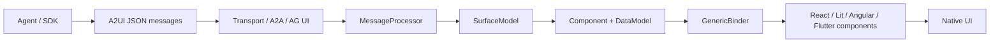
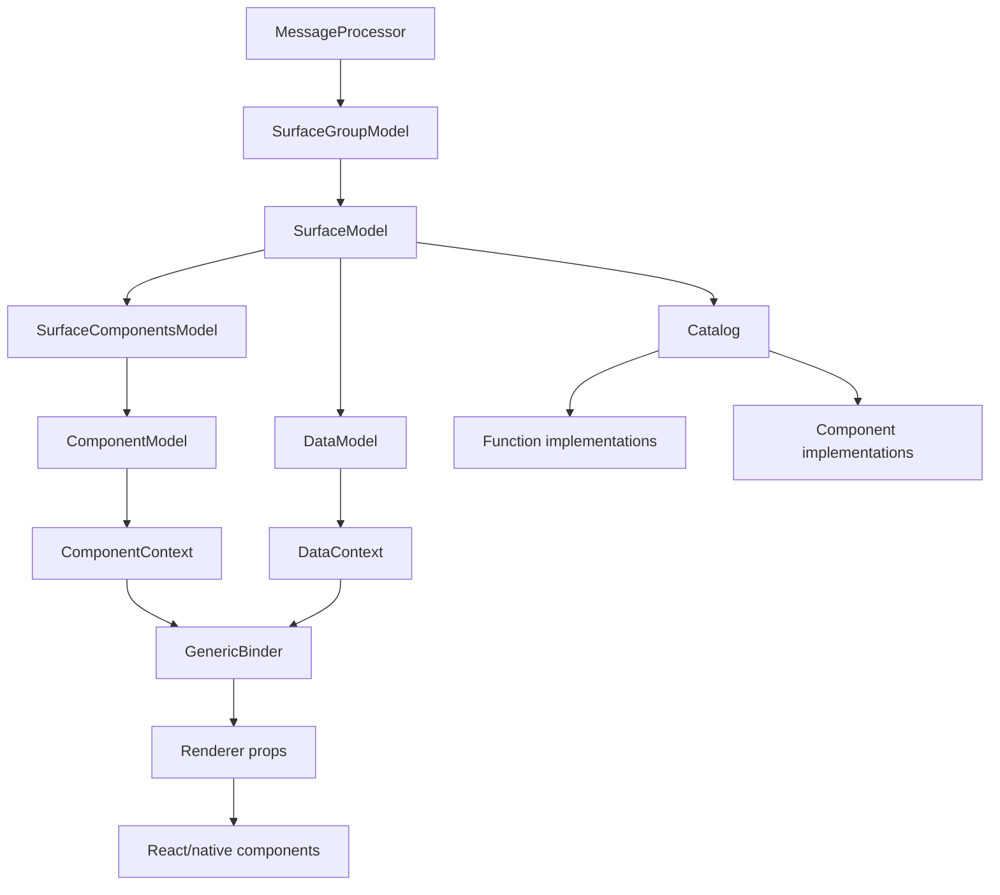

# Architecture

## 一句话架构

A2UI 把 agent 输出的 UI 意图限定为可校验的 JSON 消息流，客户端用 catalog 解释这些消息，维护 surface/component/data model 状态，再由 renderer adapter 映射到本地组件库。

## 分层

| 层 | 主要职责 | 代表文件 | 证据 |
|---|---|---|---|
| 协议层 | 定义消息类型、common types、catalog、transport 约束 | `specification/v0_9/docs/a2ui_protocol.md`, `specification/v0_9/json/server_to_client.json` | EVD-007, EVD-008 |
| Catalog 层 | 定义可用组件、函数、theme schema，形成 renderer 和 agent 的能力边界 | `specification/v0_9/catalogs/basic/catalog.json`, `renderers/web_core/src/v0_9/catalog/types.ts` | EVD-013, EVD-024 |
| 状态层 | 管理 surface、component、data model、action dispatch | `renderers/web_core/src/v0_9/state/*.ts` | EVD-017, EVD-018, EVD-019 |
| 绑定层 | 把 schema 中的 dynamic/action/child/checkable 字段变成 renderer props | `renderers/web_core/src/v0_9/rendering/generic-binder.ts` | EVD-021 |
| Renderer 适配层 | 把 A2UI component implementation 映射到具体 UI 框架 | `renderers/react/src/v0_9/A2uiSurface.tsx`, `renderers/react/src/v0_9/adapter.tsx` | EVD-014, EVD-015 |
| Agent SDK 层 | prompt 注入、JSON 修复、schema/catalog 选择、校验、A2A 转换 | `agent_sdks/python/src/a2ui/**/*.py` | EVD-027, EVD-028, EVD-029 |
| 工具/验证层 | catalog assembly、conformance、renderer tests | `tools/build_catalog/assemble_catalog.py`, `agent_sdks/conformance/README.md`, renderer tests | EVD-032, EVD-033 |

## 核心组件关系

### MessageProcessor

`MessageProcessor` 是客户端接收 A2UI server-to-client 消息的中心。它持有 `SurfaceGroupModel`，按消息类型创建 surface、更新组件、更新 data model 或删除 surface。它还暴露 `getClientCapabilities()` 和 `getClientDataModel()`，用于把支持的 catalog 和可同步 data model 反馈给 agent。

源码上，处理逻辑会拒绝同一消息中出现多个 update 类型，也会在组件 type 变化时重建 component model。这说明它把 v0.9 的消息流当作有序状态机处理，而不是简单 append-only 渲染。

### SurfaceModel

`SurfaceModel` 是单个 UI surface 的运行时实体，聚合：

- `DataModel`
- `SurfaceComponentsModel`
- `Catalog`
- `Theme`
- `sendDataModel` flag
- action/error event emitters

action 从组件触发后会通过 `SurfaceModel.dispatchAction()` 统一包装成 client action，包括 action name、surfaceId、sourceComponentId、timestamp 和 context。

### DataModel + DataContext

`DataModel` 是 JSON Pointer 可寻址的数据存储，并使用 signal/subscribe 机制通知绑定字段更新。`DataContext` 是带相对路径作用域的视图：绝对路径保留，非绝对路径会相对当前 base path 解析。这让动态列表模板可以在每个 item 的作用域内使用 `name`、`imageUrl` 这类相对绑定。

### GenericBinder

`GenericBinder` 是 renderer 通用绑定器。它根据 component schema 识别字段类型：

- dynamic value：订阅 DataModel 并输出当前值。
- action：生成点击/交互闭包，执行时解析 context 并 dispatch。
- structural child list：把 child id 或 template + path 转换成可渲染 child refs。
- checkable：执行验证函数并输出 `isValid` / `validationErrors`。
- static/object/array：按结构递归转换。

这解释了为什么 React 组件可以写得很薄：React Button 只接收 `action`、`isValid`、`child` 等 props，复杂绑定由 shared core 提前完成。

### Catalog

Catalog 既是 schema 描述，也是 runtime implementation registry。`Catalog` 对象包含组件 map、函数 map 和可选 theme schema；函数调用会通过 Zod schema 校验参数后执行。Basic Catalog 在规范里定义 schema，在 renderer 里绑定到具体 React 组件和函数实现。

### Agent SDK

Python SDK 的架构与 renderer 镜像互补：

- `A2uiSchemaManager` 选择 catalog 并生成 agent instructions。
- `A2uiValidator` 校验消息 schema、组件类型、重复 root、拓扑、循环、orphan、路径语法。
- parser 从文本中提取 `<a2ui-json>` blocks，并修正常见 JSON 问题。
- ADK toolset 将发送 A2UI 声明为 tool，执行时 parse/validate 并返回 JSON。
- A2A converter 把 tool result 或文本标签里的 A2UI 转成 A2A DataPart。

## 关键架构判断

1. A2UI 不是 UI 框架，而是 agent UI intent protocol 加 renderer runtime。
2. v0.9 的扁平 component list 是为了 streaming、incremental update 和 LLM 生成可控性服务。
3. Catalog 是系统的“可渲染能力声明”和“安全策略表”，生产采纳时它比 Basic Catalog 本身更重要。
4. `web_core` 是复用价值最高的模块；React/Lit/Angular 等 renderer 更多是 adapter 和 component implementation。
5. SDK 和 renderer 都围绕同一份 schema/catalog 建模，这是 A2UI 能跨 agent/client 校验的基础。

## 风险与推断

- 推断：如果生产系统只使用 Basic Catalog，不定义自有 catalog，那么 UI 一致性和业务安全策略会偏弱。该判断来自 catalog 文档对生产自定义 catalog 的建议，以及 renderer/SDK 均以 catalog 为能力边界。
- 推断：当前 API 仍可能变化。该判断来自本地 README public preview 声明、v0.9 evolution guide、v0.10 draft/under development 口径，以及官网 Roadmap 对 v1.0 的规划。
