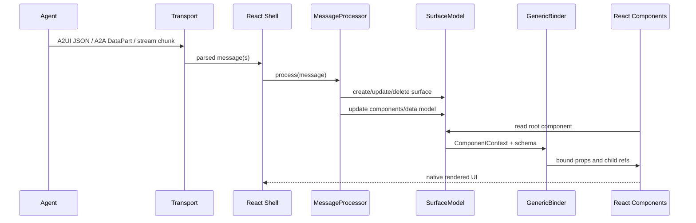
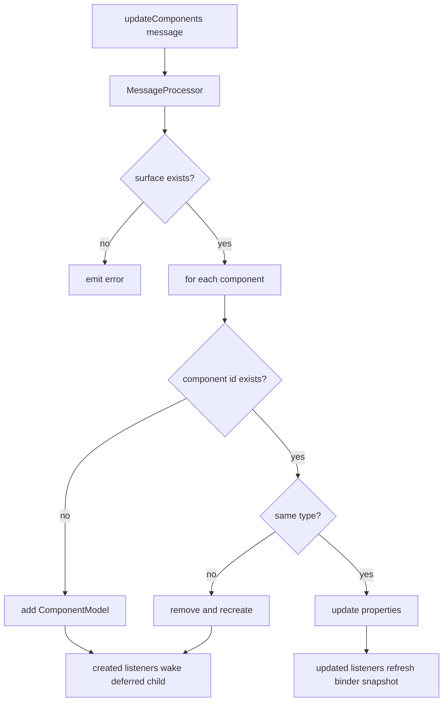
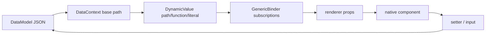
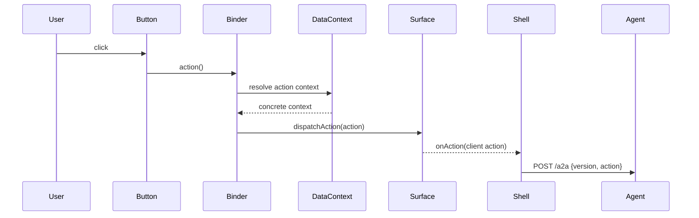
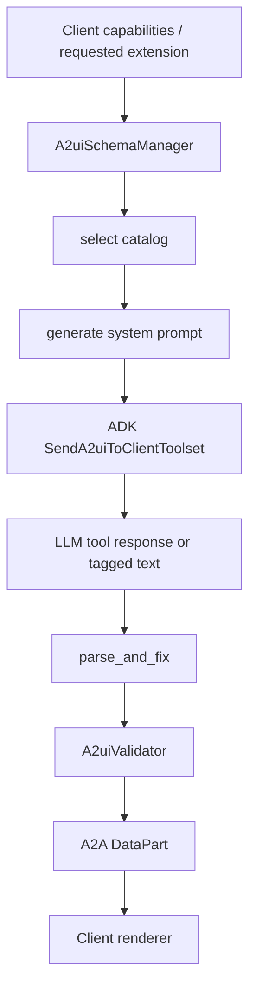
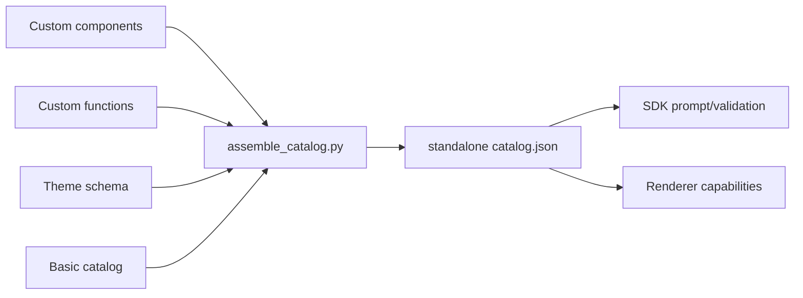

# Runtime Flows

## Flow 1: Agent 生成到 React 渲染

实现证据：

- v0.9 规范定义 server-to-client 消息是 JSON stream objects，并规定 reliable ordering、framing、metadata support 等 transport contract。
- React shell sample 从 `/a2a` 或 mock response 读取 chunks，调用 `MessageProcessor.processMessage`，再用 `<A2uiSurface>` 渲染每个 surface。
- `A2uiSurface` 固定从 `root` component 开始，以 `ComponentContext` 和 catalog component implementation 渲染子树。

## Flow 2: updateComponents 与 progressive rendering

这个流程解释了两个设计点：

- 组件列表可以分批到达，React `DeferredChild` 会在 child 未创建时显示 loading，并订阅 created/deleted。
- 组件 type 变化不是简单覆盖属性，而是重建 component model，降低 schema/implementation 不一致的风险。

## Flow 3: Data binding 与动态列表

动态列表的关键是 `ChildList` 可以是 template：

- `componentId` 指向模板组件。
- `path` 指向数组数据。
- binder 会把数组每个 index 映射成 `{id, basePath}` child ref。
- 相对绑定如 `name`、`imageUrl` 会在每个 item 的 base path 下解析。

React shell 的 restaurant mock messages 就使用这种模式渲染餐厅列表。

## Flow 4: 用户 action 回到 agent

实现细节：

- `GenericBinder` 对 action 字段生成闭包，不在渲染时立刻解析 context。
- 触发时由 DataContext 解析 dynamic context，然后 `SurfaceModel.dispatchAction` 包装 surfaceId/sourceComponentId/timestamp。
- React shell sample 的 action handler 将 client action 发送给 agent。

## Flow 5: Python SDK 生成与校验

源码显示 SDK 不只是“给模型一段提示词”。它在多个阶段施加约束：

- schema manager 根据 supported/inline/default catalog 选择 active catalog。
- toolset 在 LLM request 中追加 schema 和 examples。
- tool execution 会 parse/repair JSON，并调用 validator。
- A2A converter 可以从 tool response 或普通 text tags 中抽取 A2UI payload。

## Flow 6: Catalog assembly

Catalog 文档要求最终 catalog 是 standalone JSON。`assemble_catalog.py` 会解析本地/远程 refs，合并组件、函数和 theme，生成 `anyComponent` / `anyFunction`。这为生产设计系统接入提供了可操作路径。
