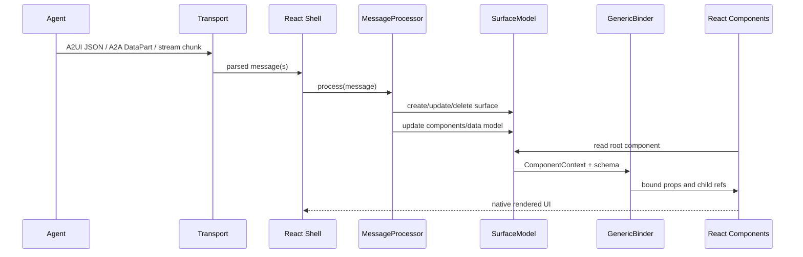
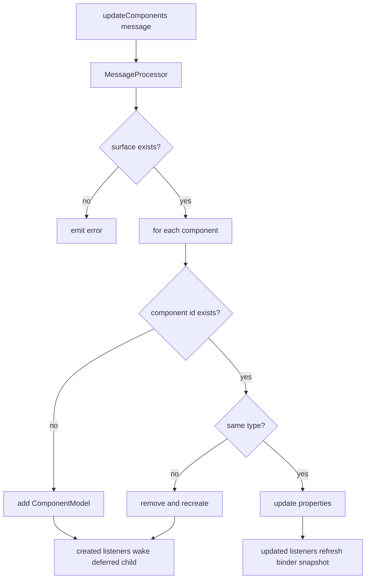
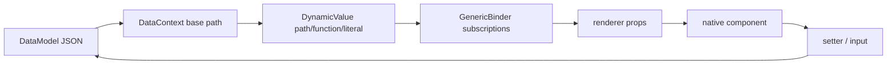
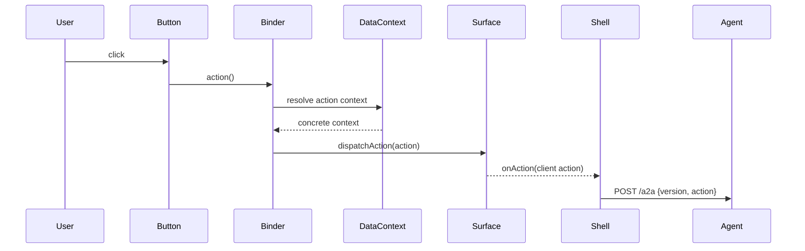
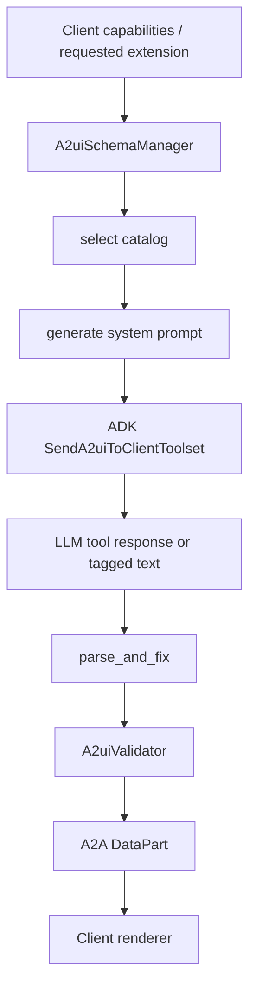
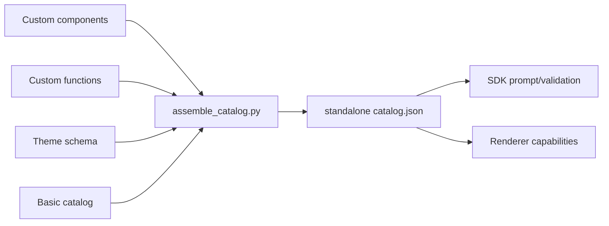

# Runtime Flows

## Flow 1: Agent Generation to React Rendering

Implementation evidence:

- The v0.9 spec defines server-to-client messages as JSON stream objects and requires a transport contract with reliable ordering, framing, metadata support, and related behavior.
- The React shell sample reads chunks from `/a2a` or mock response, calls `MessageProcessor.processMessage`, then renders each surface with `<A2uiSurface>`.
- `A2uiSurface` always starts from the `root` component and renders child trees through `ComponentContext` and catalog component implementations.

## Flow 2: `updateComponents` and Progressive Rendering

This flow explains two design points:

- Component lists can arrive in batches. React `DeferredChild` shows loading while a child has not been created and subscribes to created/deleted events.
- Component type changes are not a blind property overwrite; the component model is recreated to reduce schema/implementation mismatch.

## Flow 3: Data Binding and Dynamic Lists

The key to dynamic lists is that `ChildList` can be a template:

- `componentId` points to the template component.
- `path` points to array data.
- The binder maps each array index to a child ref `{id, basePath}`.
- Relative bindings such as `name` and `imageUrl` resolve under each item's base path.

The React shell restaurant mock messages use this pattern to render a restaurant list.

## Flow 4: User Action Back to Agent

Implementation details:

- `GenericBinder` generates a closure for action fields and does not resolve context at render time.
- When triggered, DataContext resolves dynamic context and `SurfaceModel.dispatchAction` wraps surfaceId, sourceComponentId, and timestamp.
- The React shell sample's action handler sends the client action to the agent.

## Flow 5: Python SDK Generation and Validation

The SDK is not just "a prompt for the model." Source shows constraints across several stages:

- Schema manager selects the active catalog from supported, inline, or default catalogs.
- The toolset appends schema and examples to the LLM request.
- Tool execution parses/repairs JSON and calls the validator.
- The A2A converter can extract A2UI payloads from tool responses or ordinary text tags.

## Flow 6: Catalog Assembly

Catalog documentation requires the final catalog to be standalone JSON. `assemble_catalog.py` resolves local/remote refs, merges components, functions, and theme, and generates `anyComponent` / `anyFunction`. This provides a concrete path for production design-system integration.
