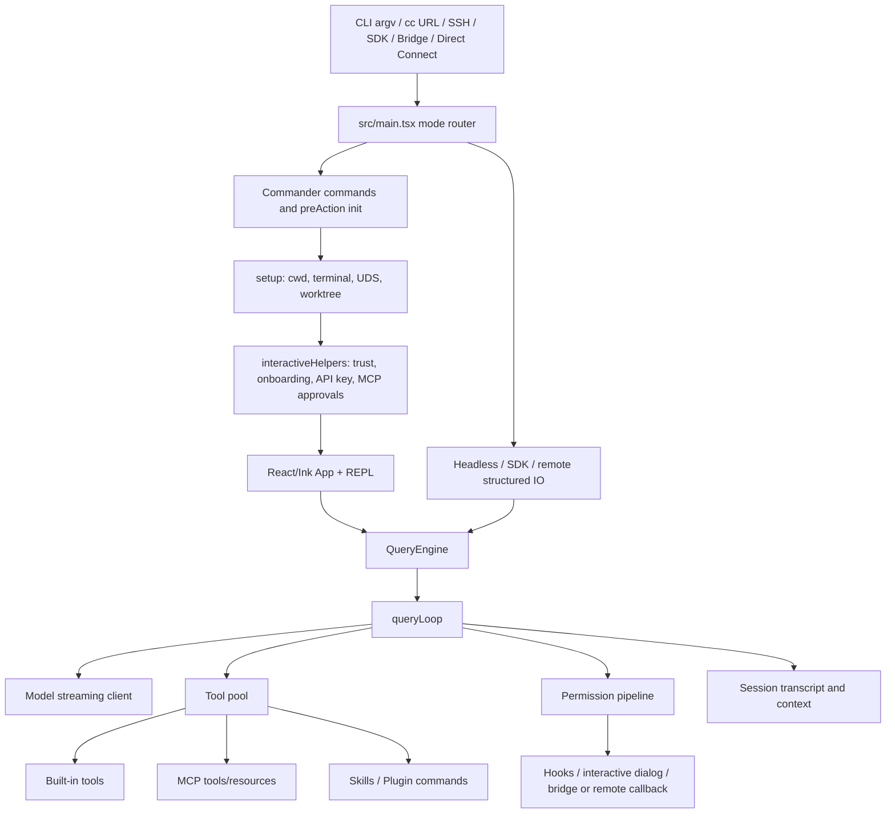

# Architecture

## 1. 总览

Claude Code 的架构不是简单的 “CLI 调模型”。它先通过 `main()` 做运行模式路由，再由 `setup()` 和交互初始化建立 trust、cwd、terminal、MCP approval、API key 等边界；交互式路径进入 React/Ink REPL，headless/SDK/remote 路径进入结构化 IO；最终都围绕 `QueryEngine`、`queryLoop`、Tool contract、permission pipeline 和 transcript storage 组织。[C-003][C-005][C-006][C-007][C-008][C-009][C-010][C-013]

## 2. 分层结构

### Entry Layer

`src/main.tsx` 在 Commander 解析之前处理多种特殊入口：direct-connect URL、deep link、assistant command、SSH command、headless 判定、interactive flag、client type 和 settings eager load。[C-003] 之后 `run()` 创建 Commander program，注册默认命令和大量 options，并在 `preAction` 中做初始化、sink、inline plugins、policy/settings sync 等工作。[C-004]

这一层的设计价值是：运行模式差异尽量在入口阶段归一，后续 query 层不用到处识别 argv 形态。

### Setup And Trust Layer

`setup()` 处理 Node 版本、custom session、UDS messaging server、terminal restore、cwd 设置和 worktree 检查。[C-005] `renderAndRun()` 及其周边逻辑把 onboarding、workspace trust、GrowthBook、system context prefetch、MCP approvals、外部 `CLAUDE.md` include warning、telemetry、API key、bypass permission dialog 和 auto-mode opt-in 放在进入 REPL 之前。[C-005]

这一层把 “能否信任当前工作区、能否调用外部能力、是否允许危险模式” 前置为运行前边界。

### Interaction Layer

`replLauncher.tsx` 动态加载 `App` 和 `REPL`。[C-006] `REPL` 保存 initial messages、MCP、tools、file history、agents、thinking、direct-connect、ssh 等交互状态，并在发起 query 前重新组装 tool permission context、tool pool、system prompt、user context 和 system context。[C-006]

这一层让 UI 保持丰富状态，但将真正的推理和工具编排交给 query 层。

### Conversation Layer

`QueryEngine` 是会话级生命周期对象。配置中包含 cwd、tools、commands、MCP clients、agents、permission callback、AppState getter/setter、read cache、prompts、model、fallback、budget、schema、SDK status、abort controller 等。[C-007] 每次 `submitMessage()` 开始一个 turn，会持久化 session，包装 permission callback，并调用 `query(...)`。[C-007]

`queryLoop` 是 turn 内主循环：追加 system context、auto-compact、调用模型、处理 stream event、执行工具、处理 fallback、刷新 tools、消耗 memory/skill prefetch，并在结束时产出结果或错误事件。[C-008]

### Tool And Permission Layer

`Tool` contract 包含 schema、call、permission、并发、只读、破坏性、渲染、open-world、MCP/LSP、defer、strict、result size、matcher、prompt 等大量语义。[C-009] `tools.ts` 是 built-in tool 的 source of truth，并通过 feature/env gate、deny rules、simple mode、dedup 和稳定排序生成 tool pool。[C-009]

tool execution 先解析 tool name 和 input schema，再进入 hooks、permission decision、speculative classifier、interactive permission、bridge/remote callback，最后才调用 `tool.call(...)`。[C-010]

### Extension Layer

扩展面包括：

- Slash command 与 Skill command。[C-011]
- Plugin manifest、plugin command、plugin skill、plugin hooks、marketplace。[C-011]
- MCP tool、resource、command、skill discovery。[C-012]
- Remote/bridge/direct-connect 控制请求中的 permission callback。[C-015]

这些扩展面最终会映射到 command、tool、permission 或 session message 语义，而不是每个入口各自维护一套执行模型。

### State And Context Layer

`bootstrap/state.ts` 维护 session id、parent session 和 project root。[C-013] `sessionStorage.ts` 管理 transcript 路径、50MB raw read cap、append buffering、UUID dedup、sidechain transcript 和 remote persistence。[C-013] `context.ts` 生成 git/user/system context，并对 git status、CLAUDE.md、current date 等做 memoization。[C-014]

## 3. 依赖方向

整体依赖方向是：

入口/REPL 依赖 QueryEngine；QueryEngine 依赖 queryLoop；queryLoop 通过 `QueryDeps` 依赖模型调用和 compact 能力；queryLoop 使用 Tool contract 和 ToolUseContext 调用工具；工具执行再回调 permission pipeline、hooks、MCP client、session/context。[C-007][C-008][C-009][C-010][C-012]

这种方向让模型 loop 不直接知道每一种 UI、插件或远程通道细节，只关心 messages、tools、permissions、events 和 state。

## 4. 核心架构判断

- 架构中心是 conversation runtime，而不是 UI。
- Tool 是系统内最重要的扩展协议对象。
- 权限不是工具的附属方法，而是跨 hooks、UI、remote、classifier 的决策流水线。
- session transcript 是长期状态基础设施，不只是日志。
- MCP、Plugin、Skill 被统一到 tool/command/resource 语义，是扩展面收敛的关键。
