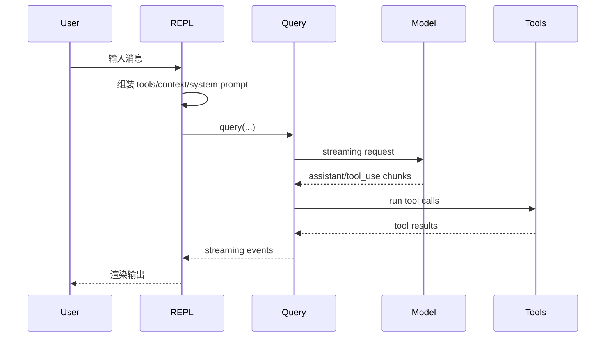

# 运行流程

## Flow 1: CLI 启动到运行模式选择

1. `main()` 首先设置 Windows `NoDefaultCurrentDirectoryInExePath=1`，降低命令执行时从当前目录解析可执行文件的风险。[C-003]
2. 注册早期 warning handler 和 SIGINT 行为。[C-003]
3. 如果命中 direct-connect URL、deep link、assistant command、SSH command，会在 Commander 前重写 argv 或进入专门流程。[C-003]
4. 通过 `-p`、`--init-only`、`--sdk-url`、TTY 状态判断是否 non-interactive，并设置 interactive flag 和 client type。[C-003]
5. `run()` 创建 Commander program，在 `preAction` 中等待 MDM/keychain prefetch、`init()`、process title、sinks、inline plugins、settings/policy sync 等初始化动作。[C-004]
6. default command 注册 `--print`、`--bare`、output/input format、permission、tools、MCP、system prompt、resume/continue、model、add-dir、ide、session、plugin-dir 等 options。[C-004]

## Flow 2: 交互式 REPL 发起一个 turn

1. `setup()` 检查 Node 版本、custom session、UDS messaging、terminal restore，并在 cwd-dependent 代码前调用 `setCwd(cwd)`。[C-005]
2. `renderAndRun()` 渲染 React/Ink root，执行 onboarding、workspace trust、GrowthBook reset/init、system context prefetch、MCP approvals、API key 和 bypass permission dialog。[C-005]
3. `replLauncher.tsx` 动态加载 `App` 和 `REPL`。[C-006]
4. `REPL` 在发起 query 前读取最新 store state，调用 `assembleToolPool(state.toolPermissionContext, state.mcp.tools)`，并合并/filter tools、agent tools。[C-006]
5. `REPL` 并行加载 default system prompt、user context、system context，构造 effective system prompt，然后 `for await` 消费 `query(...)` 事件。[C-006]

## Flow 3: `QueryEngine.submitMessage()` 到 `queryLoop`

1. `submitMessage()` 清理 discovered skills，设置 cwd，并持久化 session。[C-007]
2. 它包装 `canUseTool`，用于记录 permission denials。[C-007]
3. 调用 `query(...)`，传入 messages、system/user/system context、tool context、fallback、query source、max turns、task budget 等。[C-007]
4. `query()` 委托给 `queryLoop`，并跟踪 command lifecycle 消耗。[C-008]
5. `queryLoop` 初始化 budget tracker 和 state，启动 memory prefetch 与 skill discovery prefetch，并发出 `stream_request_start`。[C-008]
6. loop 中追加 system context，必要时 auto-compact，随后调用模型 streaming。[C-008]
7. 如果产生 tool use，进入 tool execution path；如果模型失败，根据 fallback/retry/error 规则产出事件。[C-008]
8. turn 结束后，`QueryEngine` 记录 transcript、compact boundary、assistant/user messages，并产出最终结果。[C-007]

## Flow 4: Tool 调用和权限决策

1. `runToolUse` 在当前 tool pool 中查找 tool，支持 alias fallback；找不到时返回 tool use error。[C-010]
2. 执行 input zod validation 和 tool-specific validation。[C-010]
3. 启动 speculative Bash classifier，同时运行 hooks/dialog 相关流程。[C-010]
4. PreToolUse hooks 可以修改 messages、permission、input、prevent、stop 或增加 context。[C-010]
5. permission decision 可能来自已有规则、hook、用户交互、coordinator、swarm worker、bridge callback、classifier 等。[C-010]
6. deny path 返回 tool result，并可能运行 PermissionDenied hooks；allow path 记录 telemetry/span/activity，调用 `tool.call(...)`。[C-010]
7. `runTools` 会把连续 concurrency-safe tool calls 分组并发执行；非只读或不安全工具保持串行，batch 结束后再应用 context modifier。[C-010]

## Flow 5: MCP tool discovery 和调用

1. MCP service 读取所有配置，区分 disabled/active、本地/远程和 auth 状态。[C-012]
2. 对 active clients 并行连接，抓取 tools、commands、skills、resources。[C-012]
3. MCP tool 被包装为 Claude Code `Tool`，保留 schema、description、权限提示、readOnly/concurrency/destructive/openWorld hints。[C-012]
4. 调用 MCP tool 时会确保 client 已连接，执行 timeout race，并对长运行请求每 30 秒记录日志。[C-012]

## Flow 6: Session 和 transcript

1. `getSessionId` 和 `switchSession` 维护 session identity、parent session 和 project dir。[C-013]
2. transcript path 位于 Claude config home 的 project dir 下，并使用 sessionProjectDir 保持当前 session 路径。[C-013]
3. `appendEntry` 会在 transcript materialized 前 buffer，写入 metadata，处理 sidechain agent transcript 和 remote persistence。[C-013]
4. `recordTranscript` 清理 messages，按 UUID 去重，同时保留 parent chain。[C-013]

## Flow 7: Bridge / Remote / Direct-Connect

Bridge:

1. `runBridgeLoop` 维护 active sessions、session tokens、timers、worktree、heartbeat、status display 和 cleanup。[C-015]
2. `createSessionSpawner` 启动 child CLI，参数包含 `--print --sdk-url --session-id --input-format stream-json --output-format stream-json --replay-user-messages`。[C-015]
3. child stdout 按 NDJSON 解析 activity、control_request 和 first user message；permission request 会转交 bridge callback。[C-015]

Remote:

1. `RemoteSessionManager` 通过 WebSocket 接收 SDK/control messages，通过 HTTP POST 发送用户消息。[C-015]
2. permission request 放入 pending map，响应后通过 WebSocket 发送 control response。[C-015]

Direct-connect:

1. `createDirectConnectSession` POST `/sessions`，获取 session id、ws url 和 work dir。[C-015]
2. `DirectConnectSessionManager` 连接 WebSocket，转发 SDK messages，处理 `control_request can_use_tool`，并用 stream-json 格式发送用户消息。[C-015]
