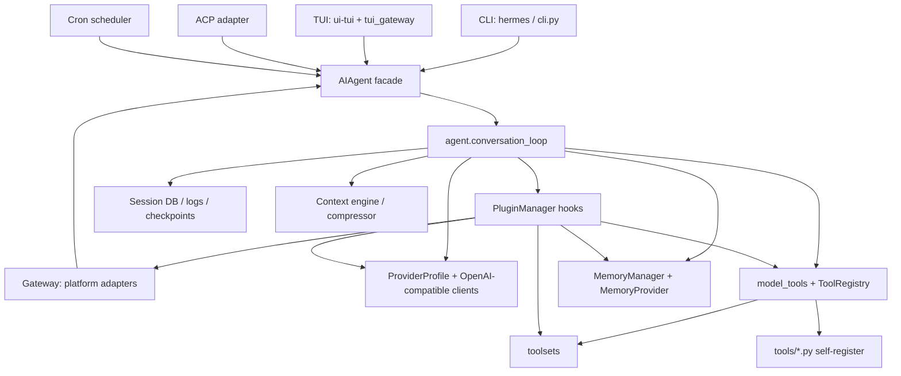
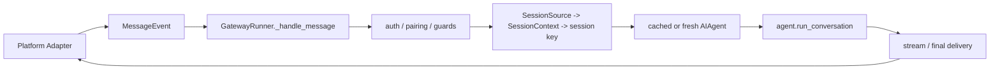

# Architecture

## 1. 一句话架构

Hermes Agent 以 `AIAgent` 为运行时核心，把 CLI、TUI、Gateway、ACP 和 cron 等入口统一成对话 turn，再通过 Provider Profile 调模型、通过 ToolRegistry 执行工具、通过 Plugin Hook 注入扩展逻辑、通过 Session Store 和 Memory Provider 保持长期上下文。[H-003][H-004][H-005][H-008][H-009]

新版外部资料阶段确认官方 README/docs 也以多入口 Agent、toolsets、plugins、memory providers、messaging gateway 和 cron 为主要能力面；本地源码进一步验证这些能力最终落在 `AIAgent`、`ToolRegistry`、plugin manager、gateway session 和 cron scheduler 上。[EXT-HA-001][EXT-HA-002][EXT-HA-003][EXT-HA-004][EXT-HA-005]

## 2. 总体结构

## 3. 分层说明

| 层 | 代表模块 | 职责 |
|---|---|---|
| Interface | `hermes_cli/main.py`, `cli.py`, `tui_gateway`, `gateway/run.py`, `acp_adapter`, `cron` | 接收用户输入、外部消息或定时任务，转换为 Agent turn |
| Agent facade | `run_agent.py` | 暴露 `AIAgent`，统一初始化参数、回调、平台上下文和会话选项 |
| Conversation runtime | `agent/conversation_loop.py`, `agent/agent_init.py` | 系统提示词、上下文、模型调用、工具调用、hook、记忆、持久化 |
| Tool plane | `tools/registry.py`, `model_tools.py`, `toolsets.py` | 工具注册、tool schema、toolset gating、dispatch |
| Extension plane | `hermes_cli/plugins.py`, `providers`, `plugins/memory`, `gateway/platform_registry.py` | 插件发现、注册、hook、Provider、Memory、Platform |
| Messaging plane | `gateway/run.py`, `gateway/platforms/base.py`, `gateway/session.py` | 多平台 adapter、session identity、streaming、delivery |
| Persistence/config | `hermes_constants`, CLI config/profile/session DB/cron jobs | profile 隔离、配置加载、日志、会话、cron 数据 |

## 4. 依赖方向

Hermes 的主要依赖方向是从入口向内收敛：

- `hermes_cli/main.py` 负责命令解析、profile override、startup discovery，然后把 chat 交给 `cli.py` 或 TUI/Gateway 子系统。[H-003][H-014]
- `run_agent.py` 中的 `AIAgent` 是门面；初始化逻辑下沉到 `agent.agent_init.init_agent`，conversation loop 下沉到 `agent.conversation_loop.run_conversation`。[H-004]
- `agent.conversation_loop` 不直接实现具体工具，而是调用 `model_tools`，再由 `tools.registry` dispatch。[H-005][H-006]
- 通用插件通过 `PluginContext` 注册工具、命令、hook、context engine、gateway platform；工具最终进入同一 Registry。[H-008]
- Provider 和 Memory Provider 是专门插件通道：Provider Profile 描述模型侧行为，Memory Provider 描述长期记忆侧行为。[H-011][H-012]

## 5. Agent runtime 边界

`AIAgent` 的构造参数覆盖 provider/model/toolsets/callbacks/platform/session/fallback 等运行期事实，说明它被设计成多入口共享的运行单元，而不是只服务 CLI 的对象。[H-004]

`agent_init` 做了大量“启动时归一化”：

- 加载 tool definitions 并记录 valid tools。[H-004]
- 建立 session ID、日志、session DB、todo、checkpoint 等状态。[H-004]
- 加载内置 memory 和外部 memory provider。[H-012]
- 建立 context engine 或内置 compressor，并拒绝上下文窗口太小的模型。[H-004]

`conversation_loop` 则负责“每一轮 turn”：

- 为 prompt caching 构建稳定 system prompt，并在后续恢复它。[H-004]
- 进入模型调用前做上下文压缩、memory/context 注入和 plugin hook。[H-004]
- 优先走 streaming API，必要时 fallback 到非 streaming。[H-004]
- 处理 tool call 的 JSON 修复、校验、guardrail、dispatch 和结果回填。[H-004][H-006]
- 收尾时保存 trajectory、session、skill review、memory sync 等。[H-004]

## 6. Gateway 架构

Gateway 是 Hermes 最重的 interface 层，负责把多平台消息转成 Agent turn：

关键点：

- Adapter 把平台输入标准化成 `MessageEvent`，并用 `BasePlatformAdapter` 提供发送、streaming draft、TTS、active session 等基础能力。[H-009]
- `SessionSource` 与 `SessionContext` 负责把 platform/chat/thread/user 等事实转成确定性 session key。[H-009]
- `GatewayRunner` 在处理消息时先执行 gateway dispatch hook，再做认证/配对，再建立 session/agent 上下文。[H-009]
- Gateway 会基于配置签名复用 `AIAgent`，避免每条消息都完全重新初始化。[H-009]
- Streaming 已经投递时，会避免重复 final delivery。[H-009]

## 7. TUI 与 ACP

TUI 不是重新实现 Agent，而是通过 Python `tui_gateway` 做 stdio JSON-RPC bridge。`tui_gateway.entry` 保证 stdout 专用于 JSON-RPC，启动时按需发现 MCP tools，然后发出 `gateway.ready`，之后循环读取 stdin dispatch。[H-013]

`tui_gateway.server` 维护 RPC method registry、session 状态、长耗时 handler 线程池、slash worker 和 prompt submit 流程；它在 `prompt.submit` 内导入 `AIAgent`，继续使用同一 Agent runtime。[H-013]

ACP adapter 也是类似策略：保留 stdout 给 ACP JSON-RPC，加载环境、做 MCP discovery，然后创建 `HermesACPAgent` 交给 `acp.run_agent`。[H-015]

## 8. 架构风险观察

- `gateway/run.py` 和 `hermes_cli/main.py` 体量很大，说明接口层复杂度尚未完全模块化。
- 插件入口很多，学习时需要区分通用插件、Provider、Memory、Platform，不宜混为一个概念。
- 多入口共享 Agent core 是优点，但也要求系统提示词、tool schema、profile、session identity 的稳定性很高。
- Gateway 同时承接外部消息、agent 调度和 delivery，一旦扩展平台很多，测试矩阵会快速扩大。
