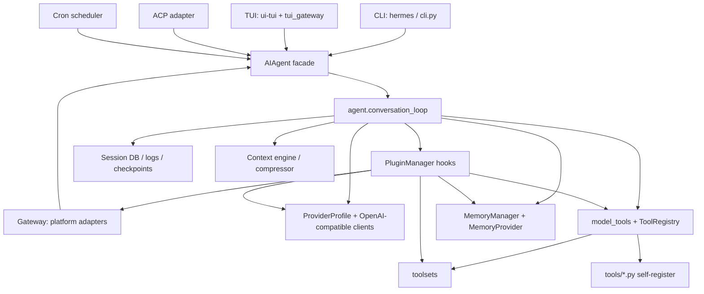
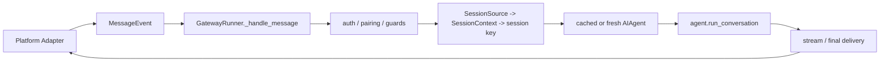

# Architecture

## 1. One-Sentence Architecture

Hermes Agent centers on `AIAgent`: CLI, TUI, Gateway, ACP, cron, and related entries are normalized into conversation turns; Provider Profile calls models, ToolRegistry executes tools, Plugin Hook injects extension logic, and Session Store plus Memory Provider preserve long-term context. [H-003][H-004][H-005][H-008][H-009]

The newer external-research stage confirms that official README/docs also present multi-entry agent, toolsets, plugins, memory providers, messaging gateway, and cron as major capability surfaces. Local source further verifies that those capabilities land in `AIAgent`, `ToolRegistry`, plugin manager, gateway session, and cron scheduler. [EXT-HA-001][EXT-HA-002][EXT-HA-003][EXT-HA-004][EXT-HA-005]

Visual supplement: [visual/architecture.html](./visual/architecture.html), graph data: [visual/architecture.visual.js](./visual/architecture.visual.js). Evidence explanation page: [visual/evidence.html](./visual/evidence.html), data: [visual/evidence.visual.js](./visual/evidence.visual.js). The HTML diagram only shows structural relationships that are already captured in this document and the evidence index.

## 2. Overall Structure

## 3. Layers

| Layer | Representative Modules | Responsibility |
|---|---|---|
| Interface | `hermes_cli/main.py`, `cli.py`, `tui_gateway`, `gateway/run.py`, `acp_adapter`, `cron` | Receive user input, external messages, or scheduled tasks and convert them into Agent turns |
| Agent facade | `run_agent.py` | Expose `AIAgent`; normalize init parameters, callbacks, platform context, and session options |
| Conversation runtime | `agent/conversation_loop.py`, `agent/agent_init.py` | System prompt, context, model calls, tool calls, hooks, memory, persistence |
| Tool plane | `tools/registry.py`, `model_tools.py`, `toolsets.py` | Tool registration, tool schema, toolset gating, dispatch |
| Extension plane | `hermes_cli/plugins.py`, `providers`, `plugins/memory`, `gateway/platform_registry.py` | Plugin discovery, registration, hooks, providers, memory, platforms |
| Messaging plane | `gateway/run.py`, `gateway/platforms/base.py`, `gateway/session.py` | Multi-platform adapters, session identity, streaming, delivery |
| Persistence/config | `hermes_constants`, CLI config/profile/session DB/cron jobs | Profile isolation, config loading, logs, sessions, cron data |

## 4. Dependency Direction

Hermes mainly converges from entries inward:

- `hermes_cli/main.py` parses commands, applies profile override, performs startup discovery, then hands chat to `cli.py` or TUI/Gateway subsystems. [H-003][H-014]
- `AIAgent` in `run_agent.py` is the facade; initialization moves into `agent.agent_init.init_agent`, and the conversation loop moves into `agent.conversation_loop.run_conversation`. [H-004]
- `agent.conversation_loop` does not implement concrete tools directly. It calls `model_tools`, which dispatches through `tools.registry`. [H-005][H-006]
- General plugins use `PluginContext` to register tools, commands, hooks, context engines, and gateway platforms; tools ultimately enter the same Registry. [H-008]
- Provider and Memory Provider are dedicated plugin channels: Provider Profile describes model-side behavior; Memory Provider describes long-term memory behavior. [H-011][H-012]

## 5. Agent Runtime Boundary

`AIAgent` constructor parameters cover runtime facts needed by many entries: provider/model/toolsets/callbacks/platform/session/fallback. This shows that it is designed as a shared runtime unit, not a CLI-only object. [H-004]

`agent_init` performs substantial startup normalization:

- Loads tool definitions and records valid tools. [H-004]
- Establishes session ID, logs, session DB, todo, checkpoints, and related state. [H-004]
- Loads built-in memory and external memory provider. [H-012]
- Creates context engine or built-in compressor and rejects models with too-small context windows. [H-004]

`conversation_loop` handles each turn:

- Builds a stable system prompt for prompt caching and restores it later. [H-004]
- Performs context compression, memory/context injection, and plugin hooks before model calls. [H-004]
- Prefers streaming API and falls back to non-streaming when needed. [H-004]
- Handles tool-call JSON repair, validation, guardrails, dispatch, and result messages. [H-004][H-006]
- Saves trajectory, session, skill review, memory sync, and related cleanup at the end. [H-004]

## 6. Gateway Architecture

Gateway is Hermes' heaviest interface layer and converts multi-platform messages into Agent turns:

Key points:

- Adapters normalize platform input into `MessageEvent` and use `BasePlatformAdapter` for send, streaming draft, TTS, active session, and related capabilities. [H-009]
- `SessionSource` and `SessionContext` convert platform/chat/thread/user facts into deterministic session keys. [H-009]
- `GatewayRunner` first invokes gateway dispatch hooks, then auth/pairing, then session/agent context creation. [H-009]
- Gateway can reuse `AIAgent` based on configuration signature to avoid full reinitialization for every message. [H-009]
- When streaming has already delivered output, final delivery avoids duplicate sends. [H-009]

## 7. TUI and ACP

TUI does not reimplement the Agent. It uses Python `tui_gateway` as a stdio JSON-RPC bridge. `tui_gateway.entry` reserves stdout for JSON-RPC, discovers MCP tools when needed, emits `gateway.ready`, then reads stdin and dispatches requests. [H-013]

`tui_gateway.server` maintains RPC method registry, session state, long-running handler thread pools, slash worker, and prompt-submit flow. Inside `prompt.submit`, it imports `AIAgent` and continues to use the same Agent runtime. [H-013]

ACP adapter follows a similar strategy: stdout is reserved for ACP JSON-RPC; environment is loaded; MCP discovery runs; then `HermesACPAgent` is created and passed to `acp.run_agent`. [H-015]

## 8. Architecture Risk Notes

- `gateway/run.py` and `hermes_cli/main.py` are very large, which suggests interface-layer complexity is not fully modularized.
- There are many plugin entries. Readers should distinguish general plugins, providers, memory, and platforms instead of merging them into one concept.
- Multi-entry shared Agent core is a strength, but it puts high stability pressure on system prompt, tool schema, profile, and session identity.
- Gateway handles external messages, agent scheduling, and delivery. As platform count grows, the test matrix expands quickly.
