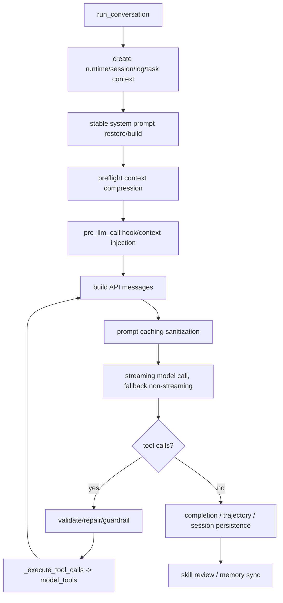
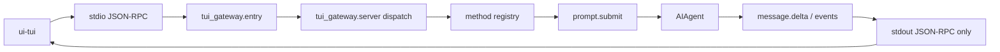
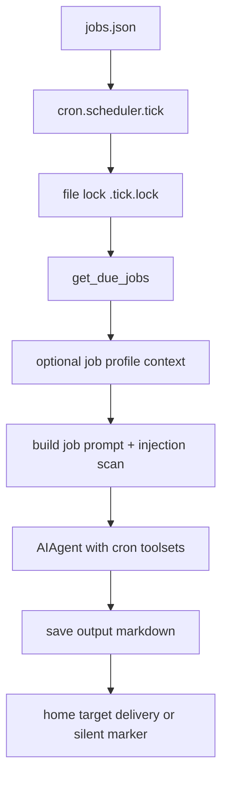

# 运行流程

## 1. CLI Chat 启动链路

```mermaid
sequenceDiagram
  participant User
  participant Main as hermes_cli.main
  participant CLI as cli.py
  participant Agent as AIAgent
  participant Loop as conversation_loop
  participant Tools as model_tools/registry
  participant Provider as Provider client

  User->>Main: hermes chat / default command
  Main->>Main: profile override + startup discovery
  Main->>Main: cmd_chat first-run/setup/env/tool options
  Main->>CLI: cli.main(**kwargs)
  CLI->>Agent: construct AIAgent
  Agent->>Agent: agent_init.init_agent
  Agent->>Loop: run_conversation
  Loop->>Provider: streaming API call
  Provider-->>Loop: text/tool calls
  Loop->>Tools: execute tool calls
  Tools-->>Loop: tool results
  Loop-->>CLI: final result/session state
```

关键状态：

- `main()` 构建 parser，并把默认命令设置为 chat。[H-003]
- `_apply_profile_override()` 在完整 parser 前预解析 profile，设置 `HERMES_HOME`。[H-003]
- `_prepare_agent_startup()` 做 plugin、MCP tools 和 shell hook 等 agent-running command 的启动发现。[H-003]
- `cmd_chat()` 处理 continue/resume、first-run setup、TUI 分支、yolo/ignore rules/env pin 等，然后导入 `cli.main` 执行。[H-014]
- `AIAgent` 构造委托 `agent_init`，`run_conversation()` 委托 `conversation_loop`。[H-004]

## 2. Agent Turn 主循环



关键状态：

- 循环开始时建立 DB session、runtime main、logging 和 task id isolation。[H-004]
- System prompt 在第一次构建后恢复，避免 prompt caching 被中途改变破坏。[H-004]
- preflight context compression 在模型调用前执行。[H-004]
- plugin/memory context 被注入当前 user message，stable system prompt 作为单独 system message prepend。[H-004]
- 流式 API 是优先路径，非流式是 fallback。[H-004]
- 达到 max iterations 时，会请求一次不带工具的 summary。[H-004]
- 收尾包括 completion determination、trajectory save、cleanup、session persistence、skill review、memory sync。[H-004]

## 3. Tool Call 执行链路

```mermaid
sequenceDiagram
  participant ToolMod as tools/*.py
  participant Registry as ToolRegistry
  participant ModelTools as model_tools
  participant Loop as conversation_loop
  participant LLM

  ToolMod->>Registry: register(definition, handler, check_fn)
  ModelTools->>Registry: get_definitions()
  ModelTools->>ModelTools: apply toolsets / disabled toolsets / cache
  Loop->>LLM: send tool schemas
  LLM-->>Loop: tool call
  Loop->>Loop: validate args / JSON repair / guardrail
  Loop->>ModelTools: handle_function_call(name, args)
  ModelTools->>ModelTools: pre_tool_call hooks / ACP approvals
  ModelTools->>Registry: dispatch(name, args)
  Registry-->>ModelTools: handler result
  ModelTools->>ModelTools: post hooks / transform result
  ModelTools-->>Loop: tool result message
```

关键状态：

- `discover_builtin_tools()` 通过 import 触发自注册。[H-005]
- Registry generation counter 参与 `get_tool_definitions` 缓存 key。[H-005][H-006]
- `model_tools` 先做 toolset 过滤和 disabled subtraction，plugin tools 也走同一路径。[H-006]
- `handle_function_call` 负责参数修正、pre_tool_call hook、ACP edit approval、registry dispatch、post hooks 和错误包装。[H-006]
- `conversation_loop` 外层还处理 tool call JSON 修复、retry、guardrail 和 `_execute_tool_calls`。[H-004]

## 4. Gateway 入站消息链路

```mermaid
sequenceDiagram
  participant Platform
  participant Adapter as BasePlatformAdapter
  participant Runner as GatewayRunner
  participant Session as gateway.session
  participant Agent as AIAgent
  participant Loop as run_conversation
  participant Delivery

  Platform->>Adapter: inbound message/event
  Adapter->>Runner: MessageEvent
  Runner->>Runner: pre_gateway_dispatch hook
  Runner->>Runner: auth / pairing / control command guards
  Runner->>Session: build SessionSource/SessionContext/session key
  Runner->>Runner: pending sentinel to avoid duplicate agent
  Runner->>Agent: cached or fresh AIAgent
  Agent->>Loop: run_conversation(history/task id)
  Loop-->>Runner: streaming/final output
  Runner->>Delivery: avoid duplicate final delivery if stream already sent
  Delivery->>Adapter: platform send/update
```

关键状态：

- `GatewayRunner` 管理 platform adapters，并在 `_create_adapter` 中优先查询 plugin platform registry。[H-009][H-010]
- `_handle_message` 先走 `pre_gateway_dispatch` hook，再执行认证/配对逻辑。[H-009]
- Gateway 使用 pending sentinel 抢占 session，避免同一 session 重复启动 agent。[H-009]
- `_run_agent` 在线程池中执行，支持 interrupt，并把 platform/user/session/gateway_session_key/session_db/fallback_model 传入 `AIAgent`。[H-009]
- Gateway 基于配置签名复用 cached AIAgent，或创建 fresh AIAgent。[H-009]
- 如果 streaming 已经投递，final delivery 会避免重复发送。[H-009]

## 5. TUI RPC 链路



关键状态：

- `entry.py` 从 sys.path 中移除 CWD shadowing 风险，安装 signal/exit 日志，并保留 stdout 给 JSON-RPC。[H-013]
- 启动时按需 discover MCP tools，然后发送 `gateway.ready`。[H-013]
- `server.py` 把长耗时 handler 放入线程池，避免 `approval.respond`、`session.interrupt` 等请求阻塞在 stdin 管道里。[H-013]
- RPC 方法通过 `@method(...)` 注册，包含 session、prompt、approval、slash、tools、cron、skills、shell、browser 等。[H-013]
- `prompt.submit` 路径会导入 `AIAgent` 并发送 `message.delta` 等事件。[H-013]

## 6. Cron 执行链路



关键状态：

- cron jobs 存在 `~/.hermes/cron/jobs.json`，输出保存到 `~/.hermes/cron/output/{job_id}/{timestamp}.md`。[H-016]
- jobs 文件修改用 in-process lock 保护，目录和文件设置 owner-only 权限。[H-016]
- scheduler `tick()` 由 gateway 后台线程每 60 秒调用，并用文件锁避免多进程重叠。[H-016]
- cron toolsets 先看 per-job `enabled_toolsets`，再看 platform `cron` tools config，失败时回退默认。[H-016]
- 定时任务支持 profile context，使 job 在指定 Hermes profile 下运行，同时隔离临时环境变量变更。[H-016]
- prompt injection scanner 会扫描组装后的 prompt，包括 skill 内容。[H-016]
