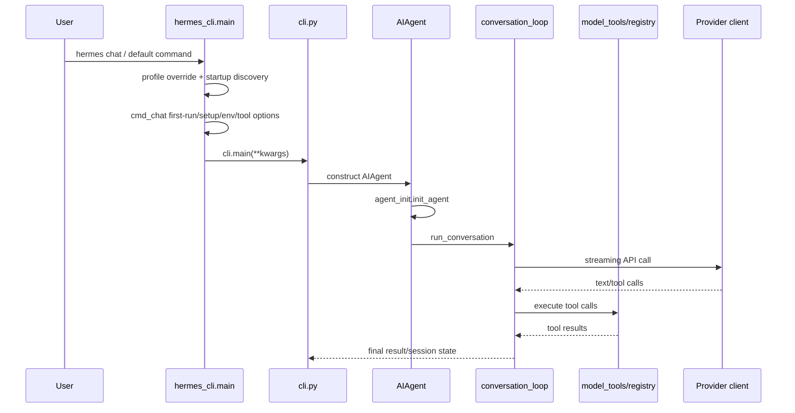
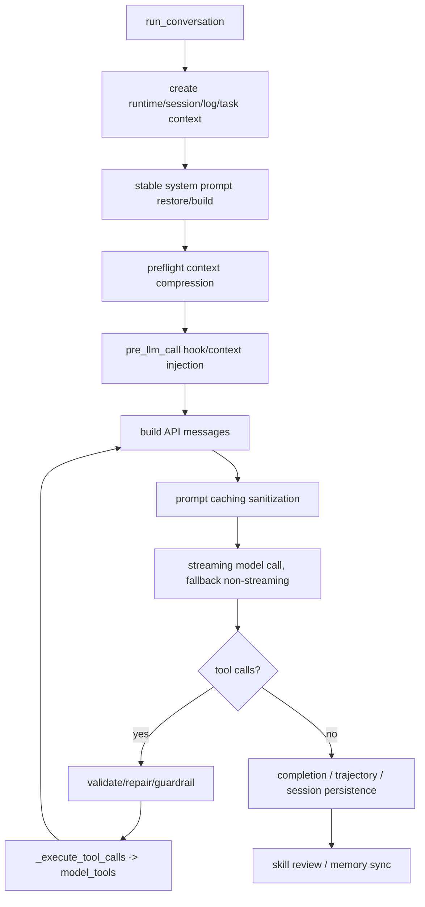
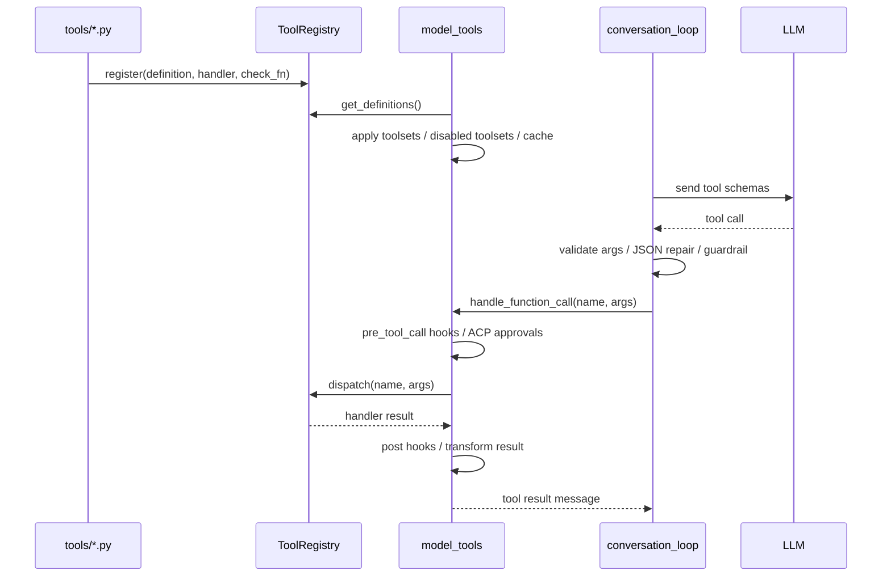
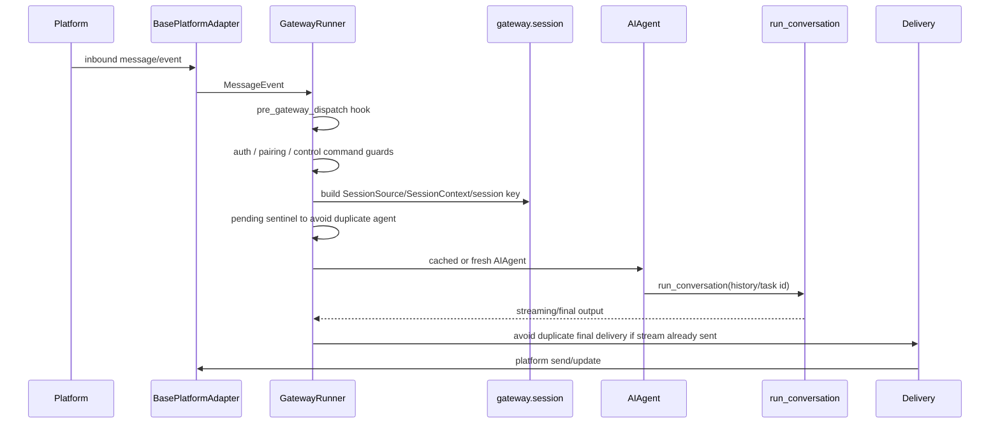
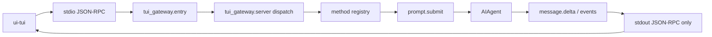
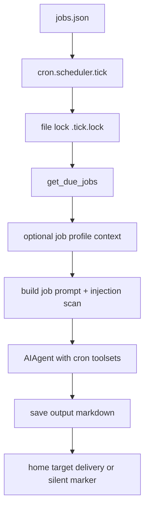

# Runtime Flows

## 1. CLI Chat Startup Path

Key state:

- `main()` builds the parser and defaults to chat command. [H-003]
- `_apply_profile_override()` pre-parses profile before the full parser and sets `HERMES_HOME`. [H-003]
- `_prepare_agent_startup()` performs startup discovery for agent-running commands, including plugins, MCP tools, and shell hooks. [H-003]
- `cmd_chat()` handles continue/resume, first-run setup, TUI branch, yolo/ignore rules/env pins, then imports and runs `cli.main`. [H-014]
- `AIAgent` construction delegates to `agent_init`; `run_conversation()` delegates to `conversation_loop`. [H-004]

## 2. Agent Turn Main Loop

Key state:

- The loop starts by establishing DB session, runtime main, logging, and task id isolation. [H-004]
- System prompt is built once and restored later to avoid breaking prompt caching. [H-004]
- Preflight context compression runs before model calls. [H-004]
- Plugin/memory context is injected into the current user message, while stable system prompt is prepended as a separate system message. [H-004]
- Streaming API is the preferred path; non-streaming is fallback. [H-004]
- At max iterations, the loop requests a final summary without tools. [H-004]
- Finalization includes completion determination, trajectory save, cleanup, session persistence, skill review, and memory sync. [H-004]

## 3. Tool Call Execution Path

Key state:

- `discover_builtin_tools()` triggers self-registration through imports. [H-005]
- Registry generation counter participates in the `get_tool_definitions` cache key. [H-005][H-006]
- `model_tools` applies toolset filtering and disabled subtraction first; plugin tools use the same path. [H-006]
- `handle_function_call` handles argument correction, pre_tool_call hook, ACP edit approval, registry dispatch, post hooks, and error wrapping. [H-006]
- The outer `conversation_loop` handles tool-call JSON repair, retry, guardrails, and `_execute_tool_calls`. [H-004]

## 4. Gateway Inbound Message Path

Key state:

- `GatewayRunner` manages platform adapters and checks the plugin platform registry first in `_create_adapter`. [H-009][H-010]
- `_handle_message` invokes `pre_gateway_dispatch` hook first, then auth/pairing logic. [H-009]
- Gateway uses a pending sentinel to claim a session and avoid duplicate agent starts for the same session. [H-009]
- `_run_agent` runs in a thread pool, supports interrupt, and passes platform/user/session/gateway_session_key/session_db/fallback_model into `AIAgent`. [H-009]
- Gateway reuses cached `AIAgent` by config signature or creates a fresh one. [H-009]
- If streaming has already delivered, final delivery avoids sending again. [H-009]

## 5. TUI RPC Path

Key state:

- `entry.py` removes CWD shadowing risk from `sys.path`, installs signal/exit logging, and reserves stdout for JSON-RPC. [H-013]
- Startup discovers MCP tools when needed, then sends `gateway.ready`. [H-013]
- `server.py` moves long-running handlers to a thread pool so requests such as `approval.respond` and `session.interrupt` do not block on stdin. [H-013]
- RPC methods are registered with `@method(...)` and include session, prompt, approval, slash, tools, cron, skills, shell, browser, and more. [H-013]
- The `prompt.submit` path imports `AIAgent` and emits events such as `message.delta`. [H-013]

## 6. Cron Execution Path

Key state:

- Cron jobs live in `~/.hermes/cron/jobs.json`; output is saved under `~/.hermes/cron/output/{job_id}/{timestamp}.md`. [H-016]
- Jobs file writes use an in-process lock, and directories/files are owner-only. [H-016]
- Scheduler `tick()` is called by the gateway background thread every 60 seconds and uses a file lock to avoid multi-process overlap. [H-016]
- Cron toolsets first check per-job `enabled_toolsets`, then platform `cron` tools config, and fall back to defaults on failure. [H-016]
- Scheduled tasks support profile context, so a job can run under a specific Hermes profile while isolating temporary environment-variable changes. [H-016]
- Prompt injection scanner checks the assembled prompt, including skill content. [H-016]
