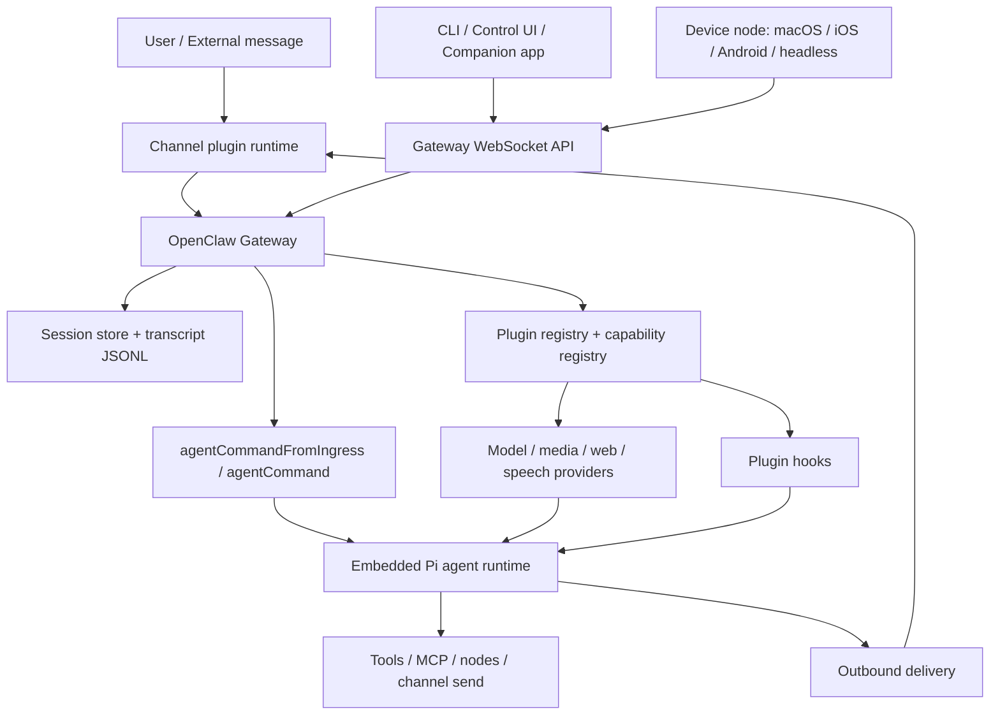

# 技术架构

Status: draft
Last Updated: 2026-05-25

## 1. 总体判断

OpenClaw 的核心架构是“本地长期运行 Gateway + 嵌入式 Agent runtime + 插件能力注册表 + 多渠道/多设备接入”。Gateway 是控制平面，负责配置、认证、WS/HTTP 协议、session、channel、plugin、events、node 和 delivery；Agent runtime 是执行平面，负责把用户输入变成模型调用、工具调用、stream 和持久化结果。[C-004][C-007]

新版外部资料阶段确认了这个判断不是单纯源码归纳：官方 Gateway architecture、Agent runtime、Session、Multi-agent 和 Plugin docs 均把 Gateway control plane、OpenClaw-owned Agent layer、capability-first plugin model 和 session/multi-agent isolation 作为核心概念；本地源码证据分别验证在 `C-004` 到 `C-012` 中。[EXT-OC-001][EXT-OC-002][EXT-OC-003][EXT-OC-004]

可视化补充：[visual/architecture.html](./visual/architecture.html)，图数据见 [visual/architecture.visual.js](./visual/architecture.visual.js)。证据解释页：[visual/evidence.html](./visual/evidence.html)，数据见 [visual/evidence.visual.js](./visual/evidence.visual.js)。该 HTML 图只展示本文和证据索引中已经沉淀的结构关系。

## 2. 分层结构

| 层 | 主要模块 | 责任 | 边界 |
|---|---|---|---|
| Launcher/CLI | `openclaw.mjs`, `src/entry.ts`, `src/cli/**` | 启动、参数、profile/container、gateway command | 不承载业务能力，只进入 CLI/Gateway |
| Gateway core | `src/gateway/**` | HTTP/WS、auth、protocol、server methods、runtime state、channel manager | Core 应保持 plugin-agnostic，不写 owner-specific policy。[C-003] |
| Agent shell | `src/agents/**` | workspace、session、skills、model 选择、delivery、Pi runtime 调用 | OpenClaw owns session/discovery/tool wiring/channel delivery，Pi core owns模型和工具循环。[C-007] |
| Plugin control plane | `src/plugins/**`, `src/plugin-sdk/**` | manifest discovery、enablement、validation、registry、runtime API | manifest metadata 不应依赖执行 plugin runtime。[C-010][C-011] |
| Bundled plugins | `extensions/**` | Provider、Channel、Tool、Hook、Service 等能力实现 | 通过 SDK/manifest/documented barrels 接入 core。[C-003][C-013] |
| State | `~/.openclaw/**` | config、agentDir、auth profiles、session store、transcripts | per-agent state/session 隔离。[C-009] |
| UI/apps/nodes | `ui/**`, `apps/**`, nodes via WS | 控制 UI、伴生 App、设备能力 | 作为 Gateway WS/HTTP client 或 node 接入。 |

## 3. 控制面与执行面

Gateway control plane 的主要职责：

- 维护 messaging surfaces 和 provider/channel 连接。[C-004]
- 提供 typed WebSocket API，收发 req/res/event frame。[C-004]
- 执行 handshake、auth、pairing、scope、origin 校验。[C-004][C-006]
- 管理 session store、chat run state、dedupe、abort controller、event subscribers。[C-006][C-008]
- 加载 plugin metadata、plugin runtime、channel runtime 和 plugin services。[C-011]

Agent execution plane 的主要职责：

- 解析 agent/session/workspace/model/skills。
- 通过 `runEmbeddedPiAgent` 调用 Pi agent core。[C-008]
- 接入 plugin hooks，如 `before_model_resolve`、`before_prompt_build`、`before_tool_call`、`agent_end`。[C-017]
- 将 assistant/tool/lifecycle stream 回传 Gateway，最终做 delivery 和持久化。[C-007]

## 4. 关键依赖方向

OpenClaw 的依赖方向很明确：

- Core -> generic plugin contracts / registry / SDK seams。
- Plugin -> `openclaw/plugin-sdk/*` 和 documented barrels。
- Core 不应直接依赖 `extensions/*/src/**` 的插件内部实现。
- Owner-specific behavior 属于 owner plugin，例如 provider auth、catalog、runtime hooks、channel policy。[C-003]

这个方向的好处是：新增 provider/channel/tool 时，优先扩展 plugin API 或 manifest contract，而不是在 core 中添加特定 owner 分支。

## 5. 架构亮点

### 5.1 Metadata-before-runtime

`openclaw.plugin.json` 是插件控制面的第一事实来源，用于身份、配置校验、能力归属、启动规划和 UI hints；runtime `register(api)` 才负责实际能力注册。这样可以在不执行插件代码的情况下做配置校验、诊断和启动计划。[C-010][C-011]

### 5.2 One Gateway, many surfaces

OpenClaw 把 CLI、Control UI、companion apps、nodes、channels 都汇入同一个 Gateway。好处是 session、auth、plugin registry、events 和 delivery 都能在一个控制面里协同，而不是每个入口各自做一套状态管理。[C-004]

### 5.3 Per-agent isolation

Agent 被定义为 workspace、agentDir、auth profiles、session store 的组合，而不只是 prompt/persona 名称。多 Agent 共享 Gateway，但在 state、workspace 和 session 级别隔离。[C-009]

### 5.4 Explicit ingress trust

CLI/local `agentCommand` 默认 trusted；网络/Gateway 入口 `agentCommandFromIngress` 必须显式提供 `senderIsOwner` 和 `allowModelOverride`。这是非常好的安全设计：入口层决定信任等级，执行层不猜测调用者是谁。[C-008]

## 6. 架构风险和复杂度

- Gateway 责任很重：auth、WS、session、channels、plugins、agent run、services 都聚合在这里。它是清晰的控制面，但也是复杂度中心。
- Plugin surface 很宽：`OpenClawPluginApi` 注册能力很多，适合强扩展平台，但需要严格文档、兼容和测试约束。[C-012]
- Bundled plugins 数量多，owner 边界很重要；一旦 core 开始直接引用具体 plugin 内部，就会破坏架构方向。[C-003]
- 多渠道、多 Agent、多 session 的组合会产生大量边界状态，后续最好补动态验证和测试证据。
