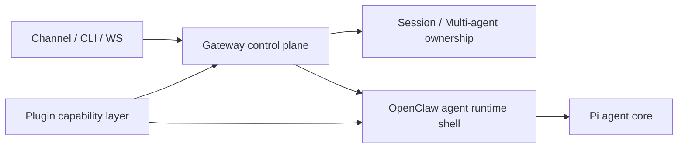
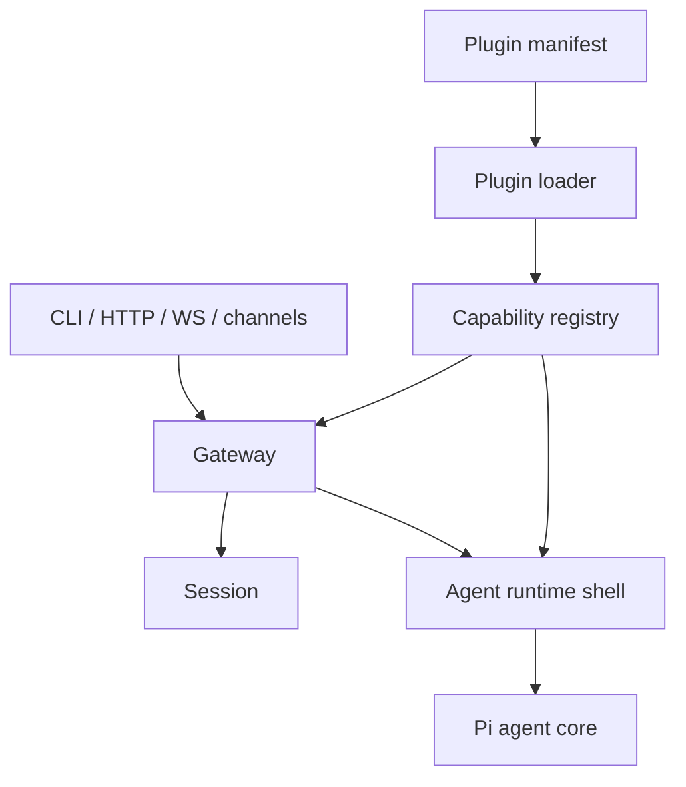

# Technical Architecture

## 1. Architecture Summary

OpenClaw is organized around a long-lived Gateway control plane. The Gateway owns HTTP/WS surfaces, protocol, events, nodes, pairing, methods, and channel coordination. Agent execution is delegated through an OpenClaw runtime shell that prepares product context and invokes Pi agent core. Plugins are declared through manifests, validated and planned before runtime loading, and then exposed through capability registries and plugin APIs. [C-004][C-007][C-010]

## 2. Architecture Context

## 3. Module Boundaries

| Module | Responsibility | Key evidence |
|---|---|---|
| Gateway | Long-lived control plane for server, WS protocol, events, methods, pairing, nodes, and channel coordination | C-004, C-005, C-006 |
| Agent runtime shell | Owns OpenClaw session/workspace/skills/model/delivery context and calls Pi agent core | C-007, C-008 |
| Pi agent core | Executes model/tool loop beneath the OpenClaw product shell | C-007, INF-003 |
| Plugin system | Discovers manifests, validates enablement, plans loading, registers runtime capabilities, and exposes APIs/hooks | C-010, C-011, C-012, C-017 |
| Session and multi-agent model | Owns DM/group/cron/webhook routing, workspaces, state, auth profiles, and history | C-009, EXT-OC-004 |
| Channel/provider plugins | Provide concrete ingress, provider, media, and outbound capabilities through manifests and runtime code | C-013, C-014 |

## 4. Core Abstractions

| Abstraction | Role | Evidence |
|---|---|---|
| Gateway server/runtime state | Creates HTTP/WS runtime and coordinates client/node/control-plane surfaces | C-004, C-006 |
| Gateway method registry | Handles RPC methods such as `agent`, including accept-first scheduling | C-008 |
| Agent command | Converts trusted ingress into prepared session/workspace/model/tool execution | C-008 |
| Plugin manifest | Declares identity, ownership, capability surfaces, config, and contracts before runtime code executes | C-010, C-013 |
| Capability registry / plugin API | Makes plugin-owned capabilities consumable by Gateway and agent runtime | C-011, C-012 |
| Session / multi-agent ownership | Binds channel/user context to isolated workspace, state, auth, and history | C-009 |

## 5. Dependency Direction

## 6. Visual Architecture

- [Open visual architecture](./visual/architecture.html)
- Graph data: [visual/architecture.visual.js](./visual/architecture.visual.js)
- Evidence viewer: [visual/evidence.html](./visual/evidence.html)
- Evidence data: [visual/evidence.visual.js](./visual/evidence.visual.js)

The visual diagram is a presentation layer. Markdown and `evidence-index.md` remain the source of research conclusions.

## 7. Data and State Flow

Gateway receives trusted ingress, resolves session and agent ownership, schedules agent execution, and records or delivers results. Session and multi-agent state define which workspace, auth profile, and history the run belongs to. Plugin registries provide tools, hooks, providers, and channels to the Gateway and agent runtime. [C-008][C-009][C-012]

## 8. Extension Mechanisms

| Extension point | How it is used | Evidence |
|---|---|---|
| Manifest | Declares plugin identity, capabilities, config, auth/contracts, and control-plane metadata | C-010, C-013 |
| Loader | Discovers, validates, plans, loads, rolls back, and activates plugins | C-011 |
| Plugin API | Registers tools, hooks, HTTP, channels, providers, media, sessions, memory, and gateway capabilities | C-012 |
| Hooks | Intercept model, prompt, tools, messages, sessions, gateway, cron, and related lifecycles | C-017 |
| Channel plugin | Encapsulates setup, config, security, status, outbound, and gateway/channel behavior | C-014 |

## 9. Architecture Tradeoffs

| Tradeoff | Benefit | Cost | Evidence |
|---|---|---|---|
| Gateway as a single long-lived control plane | Central coordination and consistent multi-surface ownership | More responsibility concentrated in Gateway | C-004, INF-002 |
| OpenClaw shell around Pi core | Product context stays separate from agent loop internals | Requires clear boundary management between shell and core | C-007, INF-003 |
| Manifest before runtime | Capability ownership and config validation can happen before code loading | Plugin authors must maintain manifest/runtime alignment | C-010, C-011 |
| Explicit network trust flags | Avoids implicit owner assumptions for remote ingress | More caller metadata and validation complexity | C-008 |

## 10. Pending Questions

- Live Gateway frames were not captured.
- Plugin reload and runtime registry output need dynamic inspection.
- Additional channels should be sampled to validate channel-contract consistency.
