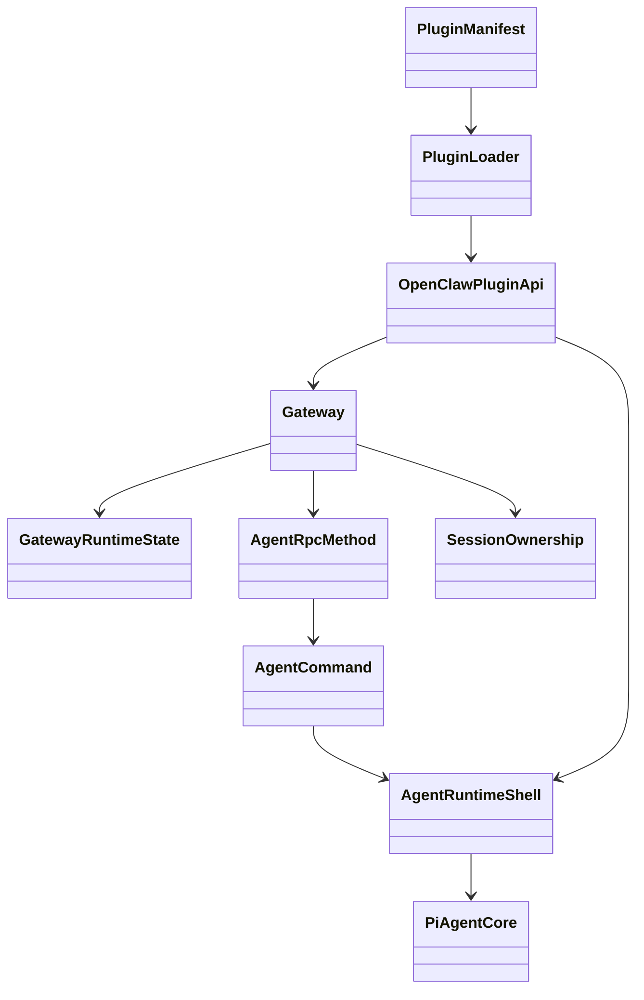

# Key Abstractions

## 1. Abstraction Overview

| Abstraction | Type | Responsibility | Lifecycle | Key evidence |
|---|---|---|---|---|
| Gateway | Runtime control plane | Owns server, WS/API surfaces, events, methods, nodes, channels, pairing, and security | Starts once per host and coordinates long-lived state | C-004, C-005, C-006 |
| Gateway runtime state | State object | Holds HTTP/WS runtime, clients, upgrade handling, and runtime context | Created during Gateway startup | C-006 |
| Gateway WS connection | Protocol/session object | Handles challenge, connect frame, auth, hello-ok, ping, and cleanup | Created per WS client connection | C-006 |
| Agent RPC method | Gateway method | Validates agent requests, registers abort controller, returns accepted ack, schedules execution | Per agent RPC request | C-008 |
| Agent command | Runtime command | Prepares session, workspace, skills, model, tools, and delivery before calling Pi agent | Per agent run | C-008 |
| Agent runtime shell | Product shell | Bridges OpenClaw context to Pi agent core | Per run/session context | C-007, INF-003 |
| Session / multi-agent ownership | State model | Binds peers, channels, workspaces, state, auth profiles, and history | Long-lived and routed per ingress | C-009 |
| Plugin manifest | Declarative contract | Declares identity, capabilities, config, auth/contracts, and control-plane metadata | Read before runtime loading | C-010, C-013, C-014 |
| Plugin loader | Runtime loader | Discovers, validates, plans, loads, rolls back, and activates plugins | Gateway startup and plugin lifecycle | C-011 |
| OpenClawPluginApi | Registration surface | Lets plugins register tools, hooks, HTTP, channels, providers, sessions, memory, and gateway surfaces | Available during plugin registration | C-012 |

## 2. Abstraction Relationships

## 3. Key Interfaces

| Interface/function | Caller | Implementer | Input | Output | Evidence |
|---|---|---|---|---|---|
| `startGatewayServer` | Gateway CLI | Gateway server wrapper/implementation | Port and runtime options | Started Gateway server | C-005 |
| WS connect handling | Control clients/nodes | Gateway WS connection handler | First `req:connect` frame | `hello-ok` on success | C-006 |
| Gateway `agent` RPC | Gateway clients/channels | `server-methods/agent.ts` | Agent request and trust metadata | Accepted ack plus async execution | C-008 |
| `agentCommandFromIngress` | Gateway agent method | Agent command layer | Ingress, session, model/tool/delivery options | Prepared agent run | C-008 |
| Plugin runtime registration | Plugin loader | Plugin runtime entry/API builder | Manifest and runtime module | Capability registrations | C-011, C-012 |

## 4. Key Data Structures

| Data structure | Fields/state | Created at | Consumed at | Evidence |
|---|---|---|---|---|
| Runtime state | HTTP server, WS server, client set, protocol context | Gateway startup | WS handlers and method registry | C-006 |
| Session state | Workspace, history, auth profile, agent ownership | Session/multi-agent routing | Agent command and delivery | C-009 |
| Plugin manifest registry | Plugin identity, capabilities, config metadata, contracts | Plugin discovery | Enablement, validation, runtime loading | C-010, C-011 |
| Capability registry | Tool, hook, provider, channel, memory, session, HTTP, gateway capabilities | Plugin runtime registration | Gateway, agent runtime, channels | C-012 |

## 5. Lifecycle Objects

| Object | Creation | Initialization | Usage | Release | Evidence |
|---|---|---|---|---|---|
| Gateway | CLI startup | Config, runtime state, plugins, services, channels | Serves HTTP/WS and coordinates agent/channel activity | Process exit | C-005 |
| WS connection | HTTP upgrade | Challenge, connect validation, hello-ok | Control/client/node communication | close cleanup | C-006 |
| Agent run | Gateway `agent` RPC | Session/model/skills/tools/delivery preparation | Pi runtime execution and streaming | final/delivery/transcript completion | C-008 |
| Plugin | Discovery | Manifest registry and registration plan | Runtime capability registration | rollback or deactivation path | C-011 |

## 6. Design Observations

- OpenClaw separates product context from agent-loop mechanics through an agent runtime shell around Pi core. [INF-003]
- Plugin capability ownership is declared before runtime loading, which makes plugin responsibilities observable and validateable early. [C-010][C-011]
- Session/multi-agent ownership is a product architecture primitive, not a later routing patch. [C-009]

## 7. Pending

- Inspect runtime registry output from an actual plugin command.
- Trace one full channel inbound to outbound delivery path dynamically.
