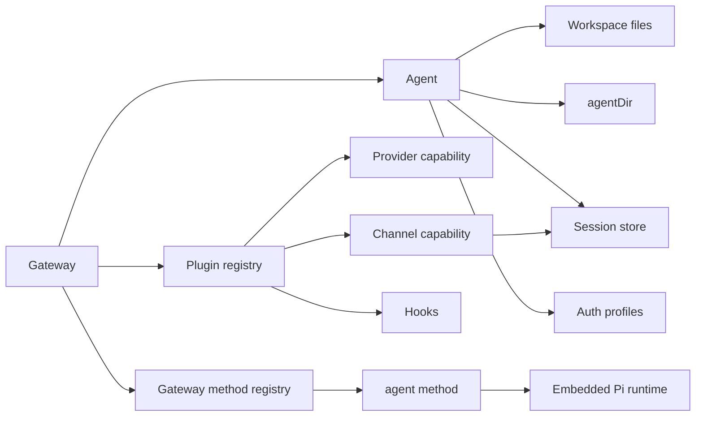

# Key Abstractions

Status: draft
Last Updated: 2026-05-25

## 1. 核心抽象表

| 抽象 | 位置 | 它是什么 | 生命周期 / 关键关系 |
|---|---|---|---|
| Gateway | `src/gateway/**` | 本地长期运行的控制平面 | 启动时加载 config/plugin/channel runtime；运行时接收 WS/HTTP 请求，管理 sessions/events/channels/nodes。 |
| Gateway WS client | `src/gateway/server/ws-connection.ts` | CLI/UI/node/webchat 等连接到 Gateway 的客户端 | 必须先 `connect` handshake，成功后加入 `clients` set，断开时清理 presence、node registry、subscriptions。[C-006] |
| Gateway method | `src/gateway/server-methods/**` | WS request method 的服务端处理器 | Core methods + plugin gateway methods + aux handlers 汇总成 method registry。[C-005] |
| Agent | `src/agents/**`, docs | 一个 persona/scope：workspace + agentDir + session store + auth profiles | 默认 `main`，也支持多 Agent 并行隔离。[C-009] |
| Session | `config/sessions`, `docs/concepts/session.md` | 会话路由和上下文持久化单位 | DM 默认共享，群/房间隔离，cron 每次新 session，transcript 写 JSONL。[C-009] |
| Workspace | `agents.defaults.workspace` | Agent 工具和上下文的 cwd | 注入 `AGENTS.md`, `SOUL.md`, `TOOLS.md`, `BOOTSTRAP.md`, `IDENTITY.md`, `USER.md`。[C-007] |
| Skill | workspace/personal/managed/bundled roots | 本地指令包 | 按优先级从 workspace、`.agents/skills`、personal、managed、bundled、extra dirs 加载。[C-007] |
| Plugin manifest | `openclaw.plugin.json` | 插件 metadata/control-plane contract | 不执行插件代码即可做 config validation、capability ownership、activation hints。[C-010] |
| Plugin registry | `src/plugins/registry.ts`, `src/plugins/loader.ts` | runtime capability collection | loader 创建 registry，插件 register 后记录 tools/providers/channels/hooks/routes/services 等。[C-011] |
| OpenClawPluginApi | `src/plugins/api-builder.ts` | 插件 runtime 注册面 | 提供 registerTool/registerProvider/registerChannel/registerGatewayMethod/on 等大量扩展 API。[C-012] |
| Channel plugin | `src/channels/**`, `extensions/*` | 消息平台适配器 | 负责 config、directory、status、gateway start、security、outbound send 等。[C-014] |
| Provider plugin | `extensions/*`, provider SDK | 模型/媒体/搜索/语音等 Provider | 通过 `api.registerProvider` 等注册能力；manifest 先声明 provider ownership。[C-013] |
| Hook | `src/plugins/hook-types.ts` | Agent/Gateway 生命周期扩展点 | 如 `before_model_resolve`, `before_prompt_build`, `before_tool_call`, `agent_end`, `message_sending`。[C-017] |
| Node | Gateway WS role `node` | 设备能力端 | macOS/iOS/Android/headless 通过 WS 连接，声明 caps/commands。[C-004] |
| Memory slot | plugin kind/slots | 独占插件槽 | docs 明确 memory 是特殊 plugin slot，一次只能激活一个 memory plugin。[C-015] |

## 2. 抽象关系

## 3. 最重要的抽象边界

### 3.1 Agent 不是单个 prompt

OpenClaw 文档把 agent 定义为 workspace、state dir、auth profiles、session store 的组合。[C-009] 这意味着多 Agent 的隔离不是靠“prompt 不同”，而是靠文件系统状态、认证状态和 session 状态分开。

### 3.2 Plugin manifest 不是 runtime registration

Manifest 用于 cheap inspection，runtime behavior 属于 plugin code 和 `register(api)`。这能让 config validation、startup planning、UI hints 不依赖动态执行第三方代码。[C-010]

### 3.3 Channel plugin 不是简单 send adapter

以 IRC 为例，channel plugin 包括 setup、capabilities、reload、config adapter、secrets、doctor、group policy、message adapter、directory、status、gateway start、pairing notify、security、outbound send。[C-014] 这说明 Channel 是一个完整子系统，不只是发送函数。

### 3.4 Hook 是生命周期扩展，不是万能业务接口

Hook 覆盖模型选择、prompt 构建、工具调用、消息收发、session 生命周期和 Gateway 生命周期。[C-017] 但 OpenClaw 的方向是 capability registration 优先，legacy hook-only 兼容保留。[C-010]

## 4. 可学习点

- 把“会话”、“Agent”、“Workspace”、“Auth profile”拆成清晰实体，有助于避免多用户混线。
- 把插件能力分成 metadata ownership 和 runtime registration，有助于先诊断、后执行。
- 把 Channel 定义成完整适配器，有利于统一 setup/status/security/delivery，不会让业务层散落各种 channel if/else。
- 把网络入口信任等级显式传入 Agent runtime，有助于权限审计。
