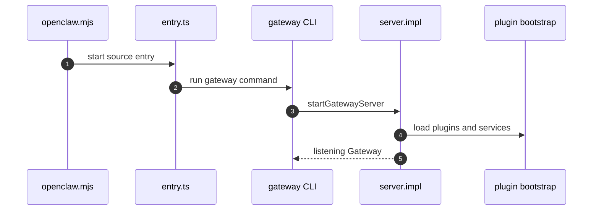
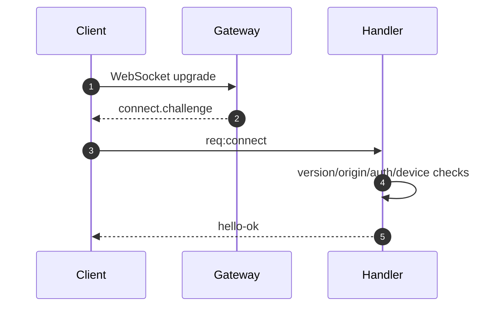
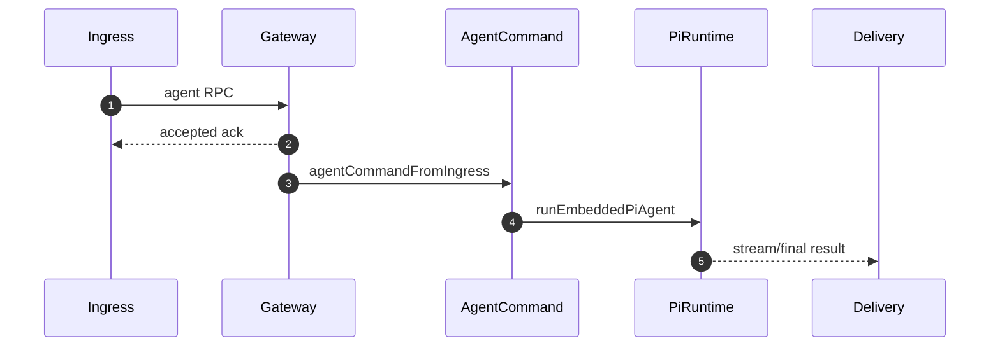

# Runtime Flows

## Flow 1: Gateway Startup

### 1. Scenario

OpenClaw starts a local Gateway process that owns HTTP/WS surfaces, plugins, channels, services, and runtime state.

### 2. Entry

| Type | Location | Notes |
|---|---|---|
| CLI launcher | `openclaw.mjs` | Node version check, source checkout detection, respawn/cache behavior |
| Main entry | `src/entry.ts` | Process and environment setup |
| Gateway CLI | `src/cli/gateway-cli/run.ts` | Config, bind/port/auth/tailscale and lazy server import |
| Gateway implementation | `src/gateway/server.impl.ts` | Runtime state, plugin bootstrap, sidecars/channels/services |

### 3. Sequence

### 4. Key Steps

| Step | Code location | What happens | State change | Evidence |
|---|---|---|---|---|
| 1 | `openclaw.mjs:11-46`, `openclaw.mjs:183-225` | Launcher validates and starts source entry | Process enters OpenClaw runtime | C-005 |
| 2 | `src/entry.ts:71-153` | Entry configures process context and imports gateway CLI | Main runtime context prepared | C-005 |
| 3 | `src/cli/gateway-cli/run.ts:503-817` | CLI parses Gateway options and imports server | Gateway startup options resolved | C-005 |
| 4 | `src/gateway/server.impl.ts:531-740` | Server implementation creates runtime state and starts services | Gateway becomes long-lived control plane | C-004, C-005 |

## Flow 2: WebSocket Handshake

### 1. Scenario

A control client or node connects to Gateway over WebSocket. The connection must complete a challenge/connect handshake before normal messages are accepted.

### 2. Entry

| Type | Location | Notes |
|---|---|---|
| HTTP upgrade | `src/gateway/server-runtime-state.ts` | Upgrade handler attached before listen |
| WS connection | `src/gateway/server/ws-connection.ts` | Challenge, client set, ping, cleanup |
| Message handler | `src/gateway/server/ws-connection/message-handler.ts` | First frame must be connect |

### 3. Sequence

### 4. Key Steps

| Step | Code location | What happens | State change | Evidence |
|---|---|---|---|---|
| 1 | `src/gateway/server-runtime-state.ts:223-358` | HTTP and WS runtime are created and upgrade handling is attached | WS runtime ready | C-006 |
| 2 | `src/gateway/server/ws-connection.ts:202-318` | Connection sends challenge and tracks timers/clients | Connection pending handshake | C-006 |
| 3 | `src/gateway/server/ws-connection/message-handler.ts:488-560` | First frame must be `req:connect` | Connection moves to validation | C-006 |
| 4 | `src/gateway/server/ws-connection/message-handler.ts:1696-1756` | Successful connect returns hello-ok metadata | Connection accepted | C-006 |

## Flow 3: Agent RPC to Agent Runtime

### 1. Scenario

Gateway receives an `agent` RPC from a trusted entry. It validates the request, returns accepted ack, and schedules asynchronous agent execution.

### 2. Entry

| Type | Location | Notes |
|---|---|---|
| Gateway method | `src/gateway/server-methods/agent.ts` | Validates, acknowledges, schedules |
| Agent command | `src/agents/agent-command.ts` | Prepares session/workspace/model/skills/delivery |
| Attempt execution | `src/agents/command/attempt-execution.ts` | Invokes embedded Pi runtime |

### 3. Sequence

### 4. Key Steps

| Step | Code location | What happens | State change | Evidence |
|---|---|---|---|---|
| 1 | `src/gateway/server-methods/agent.ts:475-583` | Request validation and setup begin | Agent request accepted for processing | C-008 |
| 2 | `src/gateway/server-methods/agent.ts:1440-1507`, `src/gateway/server-methods/agent.ts:1592-1666` | Gateway returns accepted ack and schedules execution | Async run scheduled | C-008 |
| 3 | `src/agents/agent-command.ts:1593-1643` | Network ingress must declare trust flags | Trust boundary is explicit | C-008 |
| 4 | `src/agents/command/attempt-execution.ts:630-691` | Runtime invokes embedded Pi agent with session/workspace/model/tools/delivery | Agent loop executes | C-007, C-008 |

## Flow 4: Plugin Loading and Capability Registration

### 1. Scenario

Gateway bootstraps plugins. Manifests are discovered and validated before runtime code registers capabilities.

### 2. Entry

| Type | Location | Notes |
|---|---|---|
| Plugin docs | `docs/plugins/architecture.md`, `docs/plugins/manifest.md` | Capability model and layers |
| Loader | `src/plugins/loader.ts` | Discovery, validation, planning, runtime registration |
| API builder | `src/plugins/api-builder.ts` | Capability registration surface |

### 3. Key Steps

| Step | Code location | What happens | State change | Evidence |
|---|---|---|---|---|
| 1 | `docs/plugins/architecture.md:32-51`, `docs/plugins/manifest.md:28-54` | Manifest/control-plane responsibilities are defined | Plugin metadata model established | C-010 |
| 2 | `src/plugins/loader.ts:1509-1904` | Discovery, registry, enablement, and registration plan are built | Plugin plan prepared | C-011 |
| 3 | `src/plugins/loader.ts:2314-2533` | Runtime registration and activation run with rollback paths | Capabilities become available | C-011 |
| 4 | `src/plugins/api-builder.ts:19-85`, `src/plugins/api-builder.ts:177-260` | API builder exposes registration surfaces | Gateway/agent can consume capabilities | C-012 |

## 5. Exceptions and Boundaries

| Scenario | Handling | Evidence |
|---|---|---|
| WS first frame is not connect | Connection is rejected before normal message handling | C-006 |
| Network agent ingress lacks trust metadata | Agent command requires explicit trust fields | C-008 |
| Plugin runtime registration fails | Loader has planning/rollback/activation paths | C-011 |

## 6. Design Observations

- Gateway returns accepted ack before long agent execution, which keeps network ingress responsive. [C-008]
- Trust is explicit at network ingress, avoiding hidden owner assumptions. [C-008]
- Plugin loading separates manifest planning from runtime registration. [C-010][C-011]

## 7. Pending

- Capture live WebSocket frames.
- Run a real channel inbound to delivery flow.
- Inspect live plugin registry output.
