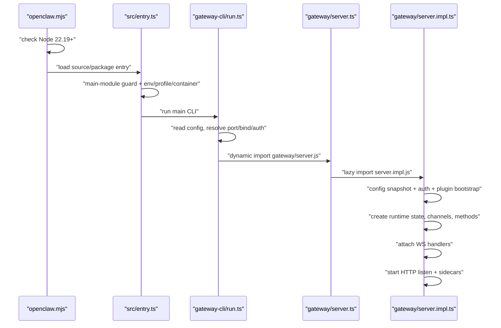
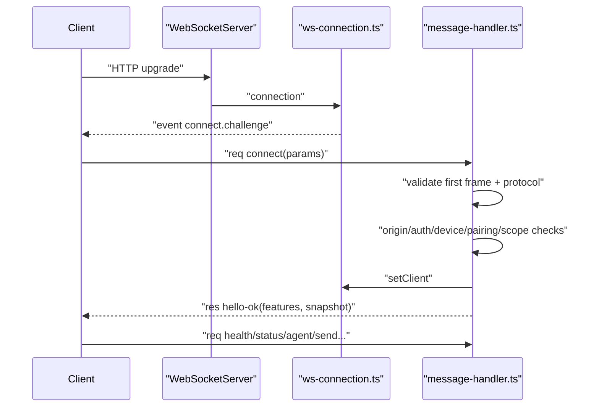
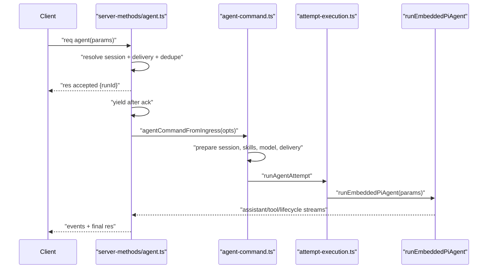
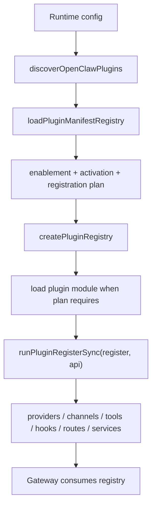

# Runtime Flows

Status: draft
Last Updated: 2026-05-25

## 1. Flow A: CLI 启动 Gateway

关键代码点：

- `openclaw.mjs` 要求 Node 22.19+，并区分 source checkout 与 packaged launcher。[C-005]
- `src/entry.ts` 使用 main module guard，避免 bundler/shared import 造成重复启动 Gateway。[C-005]
- `gateway-cli/run.ts` 读取配置、解析 auth/bind/tailscale，动态 import server module，再调用 `startGatewayServer`。[C-005]
- `server.ts` 是懒加载 wrapper，真正逻辑在 `server.impl.ts`。[C-005]
- `server.impl.ts` 启动阶段先读取 config/auth，再准备 plugin bootstrap 和 runtime state。[C-005]

## 2. Flow B: Gateway WebSocket handshake

关键代码点：

- `createGatewayRuntimeState` 在 listen 前创建 `WebSocketServer({ noServer: true })` 并 attach upgrade handler，避免连接竞态。[C-006]
- 每个 WS connection 会立即收到 `connect.challenge` nonce。[C-006]
- 第一帧必须是 `{ type:"req", method:"connect" }`，否则 hard close。[C-004][C-006]
- handshake 会检查 protocol、origin、auth、device identity、pairing、scope。[C-006]
- 成功后返回 `hello-ok`，其中 `features.methods/events` 是 discovery metadata。[C-004][C-006]

## 3. Flow C: Gateway `agent` RPC 到内嵌 Agent runtime

关键代码点：

- `agent` method 注册 abort controller 和 dedupe 后，先返回 accepted ack。[C-008]
- ack flush 后才异步调度 `dispatchAgentRunFromGateway`，避免重同步准备阻塞 immediate `agent.wait`。[C-008]
- Gateway ingress 调用的是 `agentCommandFromIngress`，要求显式 `senderIsOwner` 和 `allowModelOverride`。[C-008]
- `attempt-execution.ts` 最终把 session、workspace、model、skills、tools、delivery、abort signal 等参数传给 `runEmbeddedPiAgent`。[C-008]
- Agent loop 文档说明完整流程是 intake -> context assembly -> model inference -> tool execution -> streaming replies -> persistence。[C-007]

## 4. Flow D: Plugin discovery/load/register

关键代码点：

- `loadOpenClawPlugins` 先解析 cache/load context，再创建 runtime proxy 和 plugin registry。[C-011]
- Discovery/manifest registry 可以来自显式 snapshot，也可以现场发现插件候选。[C-011]
- 对每个 candidate，先看 manifest record、enabled state、activation state、registration plan，再决定是否 load module/register。[C-011]
- `validate`/snapshot 模式避免激活全局 runtime side effects；full 模式才激活 registry 和 global hook runner。[C-011]
- `register(api)` 失败会 rollback plugin global side effects 并恢复 registry snapshot。[C-011]

## 5. Flow E: Channel plugin outbound send

以 IRC channel 为例：

1. Manifest 声明 `channels: ["irc"]` 和 channel env vars。[C-014]
2. Channel entry 使用 `defineBundledChannelEntry` 指向 plugin/secrets/runtime export。[C-014]
3. `ircPlugin` 通过 `createChatChannelPlugin` 定义 config、directory、status、gateway、security、outbound 等能力。[C-014]
4. Outbound `sendText`/`sendMedia` 懒加载 IRC runtime，再调用 `sendMessageIrc`。[C-014]

这一流程说明：OpenClaw 的 channel 是完整平台适配层，而不是业务代码里随手调用的发送函数。

## 6. 状态变化重点

| 状态 | 何时创建/改变 | 目的 |
|---|---|---|
| `runtimeState.gatewayMethods` | Gateway 启动和插件 reload | 汇总 core/plugin/channel methods |
| `clients` set | WS handshake 成功/断开 | 广播、presence、cleanup |
| `sessionStore` / transcript | Agent run 前后 | 保持上下文和 delivery state |
| `chatAbortControllers` | agent accepted 前注册，run finally 清理 | 允许 abort/timeout |
| `PluginRegistry` | startup bootstrap / reload | 提供 hooks、providers、channels、routes、services |
| `currentPluginMetadataSnapshot` | startup/reload/shutdown | 避免重复 discovery，保持 metadata scope |
